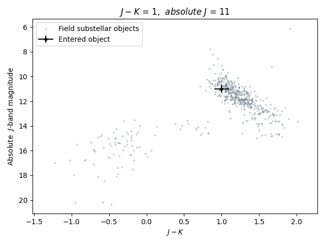
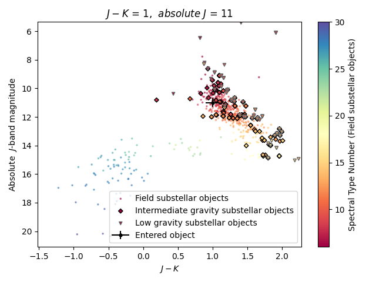
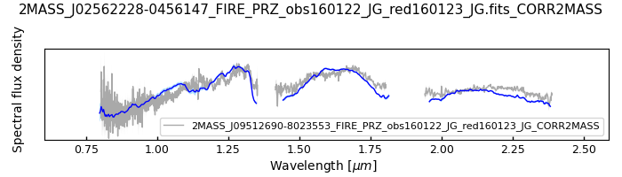
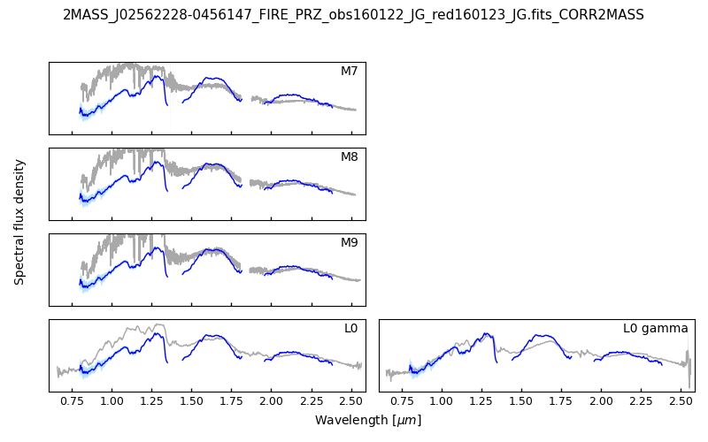

mocapy
======

**A Python package to interact with the MOCA database**

The latest version of this package was only tested with Python 3.12.3 installed with a Mac M1-native conda setup.

You can install this package with the following command::

    pip install git+https://github.com/jgagneastro/mocapy.git

One the package is installed, it is *imperative* to create a Python environment or a conda environment dedicated to its use, and install the exact versions of the packages that were used in its development. This is true because several Python packages will change over time in a non-retrocompatible way.

In order to create your own Python environment, open a terminal, navigate somewhere you will remember (e.g. your mocapy directory), and enter the following command::

    python -m venv mocapy_env

This will create a mocapy_env directory where the exact versions of the Python packages required by mocapy will be stored without interfering with your system installations. Once this is done, you need to activate this virtual environment with the follwing terminal command::

    source mocapy_env/bin/activate

Alternatively, you can create a conda environment for mocapy and then install the package inside that environment with::

    conda create --name mocapy_env python==3.12.3
	conda activate mocapy_env
	pip install git+https://github.com/jgagneastro/mocapy.git

Note that you can choose your own environment name instead of mocapy_env.

Once this is done, you should see that your command line now stars with the "(mocapy_env) " flag before the usual prompts. 

If you have downloaded the GitHub repository instead of installing it, you need to add it to your PYTHONPATH and then manually install all packages with the following command (here I am assuming you have navigated to the mocapy directory)::

    pip install -r requirements.txt

Instead of navigating to your mocapy installation directory, you can also alternatively just download the requirements file wherever your environment was created with something like wget (or manually download requirements.txt from this repo) and then install the contents::

    wget https://raw.githubusercontent.com/jgagneastro/mocapy/main/requirements.txt
    pip install -r requirements.txt

Once the packages are installed, you should be able to launch Python and use mocapy normally. Note every time you need to use mocapy, you should launch the same mocapy Python environment, by navigating wherever you have created it, and launching the same command again::

    source mocapy_env/bin/activate

If you used the conda environment instead of the pyenv environment, then you will do this instead (from anywhere)::

    conda activate mocapy_env

Documentation
-------------

The full documentation for this project is not yet available.

The following Python command lines will allow you to download data from the MOCA database using raw MySQL syntax::
    
    #Import the mocapy package
    from mocapy import *

    #Create a moca engine object
    moca = MocaEngine()
    
    #Query the moca database to obtain a Pandas DataFrame
    df = moca.query("SELECT * FROM moca_objects LIMIT 20")
    
    #See the outputs of the DataFrame
    print(df)

You can also upload your own table to the database (as a temporary table) and use it to cross-match any database entries. In this example, we will use the previous df DataFrame which we downloaded from MOCAdb, but you could use any dataframe::

    #Query the moca database again, but this time upload your own pandas DataFrame to cross-match against the database
    dfnew = moca.query("SELECT * FROM cdata_spectral_types JOIN tmp_table USING(moca_oid)",tmp_table=df)
    
    #See the outputs of the second DataFrame
    print(dfnew)

If you would like to use your own list of stellar designations, we have provided an example file in /docs/star_designations.csv, which you can use with the following example::

    # Import the necessary packages
    from mocapy import *
    import pandas as pd
    
    # Initiate a connection to the MOCA database
    moca = MocaEngine()
    
    # Locate the file with the stellar designations
    # Make sure the first line here has the word "designation" to indicate the column containing the stellar designations
    file = "/mocapy/docs/star_designations.csv"
    
    # Read the list of designations in a pandas DataFrame
    df = pd.read_csv(file)
    
    # Launch a query to MOCA joining the table "mechanics_all_designations" on your own list of stellar designations upon exact but case-insensitive matches (using the LIKE MySQL statement) in order to resolve the MOCA_OID unique identifiers, and use these moca_oid to join the summary_all_objects table containing best membership and other useful informations
    mdf = moca.query("SELECT tt.designation AS input_designation, sam.* FROM tmp_table AS tt LEFT JOIN mechanics_all_designations AS mad ON(mad.designation LIKE tt.designation) LEFT JOIN summary_all_objects AS sam ON(sam.moca_oid=mad.moca_oid)", tmp_table=df)
    
    # Display mdf summary
    print(mdf)

You should get an output similar to this::

    input_designation  moca_oid moca_aid moca_mtid  ...    gaiadr3_source_id                                   all_designations                                    designation_url  mtid_level
    0            AU Mic   10946.0     BPMG         BF  ...  6794047652729201024  MCC 824|Gaia EDR3 6794047652729201024|TYC 7457...  <a href=https://mocadb.ca/search/results?searc...         0.0
    1            HD 952  501711.0     None      None  ...  2863577296085970816  Gaia EDR3 2863577296085970816|TIC 365934195|2M...  <a href=https://mocadb.ca/search/results?searc...         NaN
    2    Barnard's Star       NaN     None      None  ...                 None                                               None                                               None         NaN
    3            HIP 12       NaN     None      None  ...                 None                                               None                                               None         NaN
    
    [4 rows x 191 columns]

In this example, the last two stars did not have a match in the MOCA database, and thus the pandas DataFrame contains missing values.

Visualizing spectra and color-magnitude diagrams
-----------------------

**Get_cmd** is a MOCA tool that plots a color-magnitude diagram (the absolute M band magnitude as a function of the difference between the magnitudes of m1 and m2 bands) of the database field brown dwarfs sequence and overplots a manually entered object. For the moment, the use of this tool requires *collaborators* access to the database.

To overplot the entered object, the difference of m1 and m2 and the absolute magnitude of band M must be provided as *m1m2* and *M*, respectively, along with their uncertainties as *em1m2* and *eM*. 

Each m1, m2 and M band can be specified using the exact unique photometry system identifier (*moca_psid*) of the moca_photometry_systems table or, more generally, the terms *"j_any"*, *"h_any"* and *"k_any"*. The bands are specified as strings through the variables *m1_type*, *m2_type* and *M_type*.

Some parameters can also be added to the CMD::

    spt : (bool) Plot the spectral types of the field BD reference sequence (default = False)
    young_objs : (bool) Plot the intermediate and low gravity substellar objects over the field reference sequence (default = False)
    ref_err : (bool) Plot the error bars of the field BD reference sequence (default = False)
    xmin, xmax = x-axis range (default = None, the range is automatically estimated)
    ymin, ymax = y-axis range (default = None, the range is automatically estimated)
    path = Path for saving the figure (default = None)
    con = Connection to the database

To set the connection, add the right environment parameters *moca_username*, *moca_password*, *moca_host* and *moca_dbname* following the *engine* command below and provide this connection to get_cmd through the parameter *con*. If no connection is specified, the default public connection is used, which does not give the access to the tool yet.

The following Python command will allow you to compare the magnitudes M and m1m2 of the entered object with the field brown dwarf sequence::

    #Import the mocapy package
    import mocapy
    from mocapy import MocaEngine
    from mocapy import MocaViz

    #Set the MOCA connection (as collaborators for now) :
    engine = create_engine("mysql+pymysql://"+moca_username+":"+urlquote(moca_password)+"@"+moca_host+"/"+moca_dbname)
    con = engine.connect()

    #Create a mocaViz object
    mocaviz = MocaViz()

    #Call the function get_cmd :
    mocaviz.get_cmd(m1m2, M, em1m2, eM, m1_type, m2_type, M_type, spt, young_objs, ref_err, xmin, xmax, ymin, ymax, path, con)

For example, to plot an entered object with an absolute magnitude in the band *mko_jmag* and difference between the bands *mko_jmag* and *mko_kmag* equal to 11 and 1, respectively, and their uncertainties over the sequence, you can use the following command::

    mocaviz.get_cmd(1, 11, 0.1, 0.3, "mko_jmag", "mko_kmag", "mko_jmag", con = con)

If you want to plot this object over the sequence showing the spectral types and the young objects (low to intermediate gravity), you can use the parameters *spt* and *young_seq*::

    mocaviz.get_cmd(1, 11, 0.1, 0.3, "mko_jmag", "mko_kmag", "mko_jmag", spt = True, young_seq = True, con = con)

**Get_spectrum** is a MOCA tool that plots the spectrum of the provided target as is or over a second target or MOCA database spectrum type reference models. For the moment, the use of this tool requires collaborators access to the database.

To display the spectrum of an object, either its designation or its unique spectrum identifier for the MOCA database (*moca_specid*) as *moca_specid* and *designation* must be provided. To add a background target spectrum, its moca_specid or designation must be specified as *moca_specid2* and *designation2*. 

To set the connection, add the appropriate environment parameters *moca_username*, *moca_password*, *moca_host* and *moca_dbname* following the *engine* command below and provide this connection to get_spectrum through the parameter *con*. If no connection is specified, the default public connection is used, which does not yet give the access to the tool.

The following Python command will allow you to display the spectrum::

    #Import the mocapy package
    import mocapy
    from mocapy import MocaEngine
    from mocapy import MocaViz

    #Set the database connection creditials - here, we are using a custom connection because the MocaViz package is currently in beta phase and only available for internal collaborators (it will become public soon). Therefore, if you are part of the collaboration you can replace the credentials below. Once MocaViz is fully released, replacing the Moca connection as below will not be necessary.

    moca_username = "104.248.106.21"
    moca_dbname = "mocadb"
    moca_username = "public"
    moca_password = "z@nUg_2h7_%?31y88"
    
    #Set the Moca connection (as collaborators for now) :
    from urllib.parse import quote_plus as urlquote
    from sqlalchemy import create_engine
    engine = create_engine("mysql+pymysql://"+moca_username+":"+urlquote(moca_password)+"@"+moca_host+"/"+moca_dbname)
    con = engine.connect()

    #Create a mocaViz object
    mocaviz = MocaViz()

    #Call the function get_spectrum :
    mocaviz.get_spectrum(moca_specid, designation, moca_specid2, designation2, spt_ref, sptn_int, gravity_class, path, con)

For example, to plot two spectra from moca_specids 500 and 527, the command would be::

    mocaviz.get_spectrum(moca_specid = 500, moca_specid2 = 527, con = con)

You can also plot the target spectrum over reference spectra of given or automatic spectral type number interval by specifying spt_ref = True. If not specified, this parameter is False and the reference spectra are not displayed. The parameter sptn_int allows you to provide a specific interval of spectral type numbers, where 0 is M0, 10 is L0 and -10 is K0, as a list. The gravity class or classes ('alpha', 'beta' or 'gamma') can also be specified as a list of strings to the parameter gravity_class. The default sptn_int and gravity_class are [7, 20], ['alpha', 'beta', 'gamma'], respectively. 

For example, the command could be::

    mocaviz.get_spectrum(moca_specid = 500, spt_ref = True, sptn_int = [7, 10], gravity_class = ['alpha', 'gamma'], con = con)

Instead of plotting the spectrum/spectra, you can use the keyword *return_data = True* when calling *get_spectrum* to return the spectrum/spectra as Pandas dataFrames. 

The command could be ::

    df = mocaviz.get_spectrum(moca_specid = 500, return_data = True, con = con)

Or ::

    df1, df2 = mocaviz.get_spectrum(moca_specid = 500, moca_specid2 = 527, return_data = True, con = con)

The output spectrum is given by the columns *lam* (wavelength), *sp* (flux) and *esp* (flux_unc). The flux units are given in the column *flux_units*.

More details about MOCA
-----------------------

This section will eventually be translated from French and gives more details about the MOCA database and how it can be used.

Je vous mets ici quelques informations par rapport à la base de données des étoiles jeunes ("Montreal Open Clusters and Associations"/MOCA database). Elle est en language MySQL, qui est vraiment très bien documenté sur internet.

Elle est plutôt complète jusqu'à 500 pc, mais j'ai récemment commencé à ajouter des amas ouverts un peu plus distants aussi. Elle contient aussi presque toutes les naines brunes connues.

Pour l'utiliser, téléchargez l'app Sequel Ace sur le Apple Store, puis utilisez les informations suivantes (à ne pas partager car la DB n'est pas encore publique)::

    MySQL host : 104.248.106.21
    MySQL database : mocadb
    MySQL username : public
    MySQL password : z@nUg_2h7_%?31y88

Vous pouvez ensuite consulter les tables listées à gauche, et changer de mode avec les boutons dans la barre du haut. "Structure" vous donne accès aux colonnes d'une table et leur type (voir "Comments" pour une description, je n'ai pas fini de les documenter); "Contents" vous montre les premières lignes du contenu, que vous pouvez filtrer avec le petit bouton d'entonnoir en bas de la table. "Query" vous permet de lancer des requêtes SQL, de voir les résultats, et de les télécharger en CSV au besoin. Il y a aussi un bouton "Table Info" qui vous permet de voir une description de chaque table.

Vous avez aussi accès à la base de données "mocadb_private_tables" avec le menu déroulant en haut, qui contient aussi des données non publiées. Je suis activement en train de travailler sur cette base de données donc elle change beaucoup en ce moment; la DB par default "mocadb" est un snapshot fixe du ~10 juin 2022, qui sera générée automatiquement à partir de mocadb_private_tables en omettant les données privées quand j'aurai terminé de construire l'infrastructure.

Vous pouvez communiquer directement avec la base de données avec les packages Python pandas et sqlalchemy, mais si vous entrez le password en format string directement dans votre code vous allez devoir transformer certains symboles pour que ça fonctionne (une recherche Google vous donnera plus d'informations là-dessus). Voir la fonctions read_sql de pandas en particulier.

Dans la database, les colonnes moca_* sont utiles pour connecter des tables ensemble avec JOIN. Par exemple, moca_oid est un identifiant unique pour chaque étoile, moca_aid pour chaque association, et moca_pid pour les publications scientifiques.

La database contient quelques procédures et fonctions qui sont listées sous les tables. Celles qui commencent par "engine_" dans la DB privée sont pour la mise à jour des données, vous ne pourrez pas les rouler. Vous pouvez appeler les autres fonctions dans la vue SQL Query avec la syntaxe "CALL function_name(input);"

Voici quelques fonctions utiles:

REPORT: obtenir une vue d'ensemble des informations relatives à une étoile à partir de son nom. Utiliser % pour un wildcard, mais évitez de commencer le nom par un wildcard sinon ça sera très lent. Exemple: CALL REPORT('SIMP%0136%');

GAIAREPORT: Similaire, mais fonctionne juste avec les source_id de Gaia (tous les data release). C'est plus rapide que d'utiliser REPORT avec un wildcard.

IDREPORT: Similaire, mais prend en input un chiffre moca_oid.

AREPORT: obtenir une vue d'ensemble des informations relatives à une association d'étoiles, à partir de son nom. Exemple: CALL AREPORT('AB Dor%');

AIDREPORT: Similaire, mais prend en entrée un string moca_aid.

Les tables de la base de données ont des préfixes qui indiquent le type de table:

cat_ sont des sections de catalogues astronomiques, tels que Gaia ou 2MASS. Ils sont téléchargés tels quels de serveurs astronomiques pour les étoiles présentes dans MOCAdb.

data_ sont des données brutes de la littérature, typiquement reliés à une étoile ou une association. Certaines de ces données sont importées des tables cat_ automatiquement et périodiquement par l'infrastructure de MOCAdb. D'autres sont téléchargées directement de Vizier ou de papiers scientifiques.

calc_ sont des valeurs calculées automatiquement par l'infrastructure MOCAdb. Parfois ce sont des combinaisons de toutes les mesures disponibles par étoile, parfois ce sont des quantités nouvelles.

cdata_ contiennent un mix de données de littérature (typiquement avec un moca_pid non nul) ou de calculs faits par MOCAdb (typiquement avec un md5_uid non nul).

mechanics_ contiennent des tables générées automatiquement par MOCAdb qui font intervenir des combinaisons d'autres tables dans la DB mais pas nécessairement des calculs.

summary_ contiennent des tables-sommaire regroupant des données d'un ensemble d'autres tables dans la DB.

priv_ contiennent des tables non publiées.

pcat_ contiennent dew catalogues privés (non publiés).

Vous avez aussi accès à des séquences astronomiques (couleur-mag, masse vs type spectral etc) décrites dans la table moca_astrophysical_sequences. Choisissez le moca_seqid qui vous intéresse depuis cette table, puis allez chercher les données dans la table data_astrophysical_sequences en choisissant seulement les lignes qui ont cette valeur de moca_seqid et vous avez votre séquence.

Voici quelques exemples de code SQL::

    SELECT *
    FROM mechanics_all_designations
    WHERE designation LIKE "SIMP%0136%";

Cette requête vous permettra de retrouver le moca_oid de SIMP0136 en regardant la compilation de toutes les désignations de la base de données. Notez que les retour de lignes sont facultatifs. La partie SELECT * signifie que je veux retrouver toutes les colonnes de la table dans mon résultat::

    SELECT *
    FROM mechanics_all_designations
    INNER JOIN cdata_spectral_types USING(moca_oid)
    WHERE designation LIKE "SIMP%0136%";

Cette requête joindra sur votre résultat toutes les mesures de type spectraux associées à SIMP0136 dans la base de données. Notez que INNER JOIN peut être aussi simplement appelé JOIN. La clause USIGN signifie que vous joindrez les lignes pour lesquelles moca_oid sont identiques. Cette clause peut aussi être remplacée par ON(designation.moca_oid=cdata_spectral_types.moca_oid) qui pourrait contenir des tests logiques plus complexes si désiré. Notez aussi que les JOIN utilisant des colonnes indexées dans la base de données (telles que moca_oid) seront très rapides, mais ceux effectués sur des colonnes non indexées seront beaucoup plus lents (les index prennent de l'espace disque et j'en ai généralement construit seulement pour les colonnes moca_\*)::

    SELECT *
    FROM mechanics_all_designations
    INNER JOIN cdata_spectral_types USING(moca_oid)
    WHERE designation LIKE "SIMP%";

Cette requête vous permettra d'obtenir une liste de tous les objets avec une désignation SIMP avec leurs types spectraux. Chaque objet pour lequel plusieurs types spectraux ont été publiés se retrouvera répété dans plusieurs lignes. Pour obtenir seulement un type spectral, on pourrait utiliser::

    SELECT mad.designation, spt.moca_oid, spt.spectral_type
    FROM mechanics_all_designations AS mad
    INNER JOIN cdata_spectral_types AS spt USING(moca_oid)
    WHERE designation LIKE "SIMP%"
    GROUP BY mad.moca_oid;

Ici, j'ai spécifié des surnoms pour les tables (mad et spt) pour simplifier la requête (le mot AS pourrait être omis entièrement), et un GROUP BY pour combiner ensemble toutes les lignes dont le moca_oid est identique. Notez que l'ordre des clauses importe, WHERE doit suivre tous les JOIN, et précéder GROUP BY. Telle quelle, cette commande retournera n'importe quelle valeur de type spectral disponible, sans préférence. Remarquez que j'ai aussi seulement sélectionné quelques colonnes dans cette requête. Je pourrais aussi concaténer toutes les valeurs de types spectraux publiées ainsi::

    SELECT mad.designation, spt.moca_oid, GROUP_CONCAT(spt.spectral_type) AS all_spts
    FROM mechanics_all_designations AS mad
    INNER JOIN cdata_spectral_types AS spt USING(moca_oid)
    WHERE designation LIKE "SIMP%"
    GROUP BY mad.moca_oid;

On pourrait aussi aller chercher seulement le type spectral le plus récent pour chaque objet en utilisant la date de publication dans la table moca_publications, qui sera jointe en utilisant le moca_pid associé à chaque mesure de type spectral::

    SELECT mad.designation, spt.moca_oid, spt.spectral_type, mp.moca_pid, mp.pubdate
    FROM mechanics_all_designations AS mad
    INNER JOIN cdata_spectral_types AS spt USING(moca_oid)
    INNER JOIN moca_publications AS mp ON(mp.moca_pid=spt.moca_pid)
    WHERE designation LIKE "SIMP%";

Notez que dans une situation comme ici où plus de 2 tables ont déjà une colonne moca_pid (mechanics_all_designations et cdata_spectral_types peuvent chacun être associés à une publication), nous avons été forcés de remplacer USING par ON et de specifier les moca_pid de quelles tables doivent se connecter.

Ici, je n'ai pas tout de suite utilisé un GROUP BY, et j'ai seulement été chercher l'année de publication pour chaque type spectral. L'une des plus grosses lacunes de MySQL est l'impossibilité d'aller choisir toutes les colonnes où une colonne spécifique prend sa valeur maximale avec un GROUP BY, qu'on pourrait tenter d'effectuer avec cette commande::

    SELECT mad.designation, spt.moca_oid, spt.spectral_type, mp.moca_pid, MAX(mp.pubdate)
    FROM mechanics_all_designations AS mad
    INNER JOIN cdata_spectral_types AS spt USING(moca_oid)
    INNER JOIN moca_publications AS mp ON(mp.moca_pid=spt.moca_pid)
    WHERE designation LIKE "SIMP%"
    GROUP BY mad.moca_oid;

Bien que cette commande nous donnera l'année la plus récente associée aux types spectraux de chaque objet, il n'est pas garanti que la valeur du type spectral elle-même ne provienne pas d'une autre publication dans la requête! Pour remédier à cette situation, nous sommes forcés de contourner le problème avec un peu moins d'élégance, en construisant un genre de numéro de ligne (que nous nommerons sptrowid) pour les types spectraux de chaque objet individuellement, qui ira donc de 1 à N pour un objet avec N mesures de type spectral, tout en faisant attention à ordonner les publications des plus récentes aux plus anciennes. La commande suivante nous permettra d'obtenir sptrowid: ROW_NUMBER() OVER(PARTITION BY moca_oid ORDER BY mp.publication_date DESC) AS sptrowid. Ainsi::

    SELECT mad.designation, spt.moca_oid, spt.spectral_type, mp.moca_pid, mp.pubdate, ROW_NUMBER() OVER(PARTITION BY moca_oid ORDER BY mp.pubdate DESC) AS     sptrowid
    FROM mechanics_all_designations AS mad
    INNER JOIN cdata_spectral_types AS spt USING(moca_oid)
    INNER JOIN moca_publications AS mp ON(mp.moca_pid=spt.moca_pid)
    WHERE designation LIKE "SIMP%";

Ceci nous permettra ensuite de sélectionner seulement les lignes avec sptrowid=1, mais nous serons forcés d'appliquer ce filtre dans une deuxième étape séparée, car MySQL ne nous permet pas de filtrer directement les valeurs sptrowid construites avec ROW_NUMBER() ON... (c'est une contrainte malheureuse de ce type de fonction qu'on appelle des "window functions). On peut appliquer le filtre avec la commande suivante::

    SELECT * FROM
    (
    SELECT mad.designation, spt.moca_oid, spt.spectral_type, mp.moca_pid, mp.pubdate, ROW_NUMBER() OVER(PARTITION BY moca_oid ORDER BY mp.pubdate DESC) AS sptrowid
    FROM mechanics_all_designations AS mad
    INNER JOIN cdata_spectral_types AS spt USING(moca_oid)
    INNER JOIN moca_publications AS mp ON(mp.moca_pid=spt.moca_pid)
    WHERE designation LIKE "SIMP%"
) AS subquery
    WHERE sptrowid=1

Remarquez que MySQL commence les identifiants de lignes par 1 et non zéro. De plus, MySQL nous force à assigner un surnom à toute table qui résulte d'une requête nichée au sein d'une autre requête.

On peut aussi utiliser la clause ORDER BY pour réordonner les colonnes, par exemple si on veut les ordonner par types spectraux (on doit utiliser la colonne contenant le type spectral numérique pour le faire correctement)::

    SELECT * FROM
    (
    SELECT mad.designation, spt.moca_oid, spt.spectral_type, mp.moca_pid, mp.pubdate, ROW_NUMBER() OVER(PARTITION BY moca_oid ORDER BY mp.pubdate DESC) AS sptrowid
    FROM mechanics_all_designations AS mad
    INNER JOIN cdata_spectral_types AS spt USING(moca_oid)
    INNER JOIN moca_publications AS mp ON(mp.moca_pid=spt.moca_pid)
    WHERE designation LIKE "SIMP%"
    ORDER BY spt.spectral_type_number
    ) AS subquery
    WHERE sptrowid=1

Lorsqu'on utilise la commande INNER JOIN ou JOIN, MySQL ignorera toujours les lignes pour lesquelles aucune correspondance n'a été trouvée dans la deuxième table. Si on veut conserver les objets SIMP dont aucun type spectral n'est disponible, on peut opter pour l'utilisation d'un LEFT OUTER JOIN (ou LEFT JOIN pour abréger)::

    SELECT mad.designation, spt.moca_oid, spt.spectral_type
    FROM mechanics_all_designations AS mad
    LEFT JOIN cdata_spectral_types AS spt USING(moca_oid)
    WHERE designation LIKE "SIMP%";

On peut aussi utiliser cette syntaxe pour choisir spécifiquement les entrées SIMP qui n'ont pas de type spectral::

    SELECT mad.designation, spt.moca_oid, spt.spectral_type
    FROM mechanics_all_designations AS mad
    LEFT JOIN cdata_spectral_types AS spt USING(moca_oid)
    WHERE designation LIKE "SIMP%" AND spt.spectral_type IS NULL;

On pourrait aussi ajouter toutes les mesures de mouvement propre disponibles::

    SELECT mad.designation, spt.moca_oid, spt.spectral_type, pm.pmra_masyr, pm.pmdec_masyr
    FROM mechanics_all_designations AS mad
    LEFT JOIN cdata_spectral_types AS spt USING(moca_oid)
    LEFT JOIN data_proper_motions AS pm USING(moca_oid)
    WHERE designation LIKE "SIMP%";

Mais vous allez remarquer que certains de ces objets ont un grand nombre de mesures de mouvement propre. La base de données MOCAdb va périodiquement choisir la valeur de mouvement propre la plus précise pour chaque étoile, et lui assigner la valeur 1 dans la colonne "adopted". On peut ainsi choisir la meilleure valeur seulement avec::

    SELECT mad.designation, spt.moca_oid, spt.spectral_type, pm.pmra_masyr, pm.pmdec_masyr
    FROM mechanics_all_designations AS mad
    LEFT JOIN cdata_spectral_types AS spt USING(moca_oid)
    LEFT JOIN data_proper_motions AS pm USING(moca_oid)
    WHERE designation LIKE "SIMP%" AND pm.adopted=1;

De façon plutôt contre intuitive, il est généralement beaucoup plus rapide de filtrer dans la clause "WHERE" à la fin de la requête, plutôt que directement dans la clause "ON" lors de l'ajout de la table data_proper_motions, ou pire, qu'une sous-requête du type::

    SELECT mad.designation, spt.moca_oid, spt.spectral_type, pm.pmra_masyr, pm.pmdec_masyr
    FROM mechanics_all_designations AS mad
    LEFT JOIN cdata_spectral_types AS spt USING(moca_oid)
    LEFT JOIN (SELECT * FROM data_proper_motions WHERE adopted=1) AS pm USING(moca_oid)
    WHERE designation LIKE "SIMP%"

Ceci est vrai parce que MySQL ne va pas nécessairement s'exécuter dans l'ordre selon lequel nous avons listé les clauses; le language construira d'abord un plan d'action pour maximiser la performance, puis exécutera seulement les étapes requises dans l'ordre le plus efficace qu'il puisse trouver. Lorsque des sous-requêtes sont nichées entre parenthèses, il est généralement beaucoup plus difficile pour MySQL d'interpréter le code globalement et de trouver le meilleur plan d'exécution.

Dans une autre situation, on pourrait vouloir aller chercher une liste de toutes les étoiles d'une association jeune. Prenons par exemple l'association cinématique AB Doradus, donc le moca_aid = 'ABDMG' comme on peut le voir à la table moca_associations. Plusieurs choix se présentent à nous pour dresser une telle liste. La méthode la plus simple serait de lancer une requête dans la table data_memberships, qui contient toutes les remarques de la littérature par rapport aux membres d'ABDMG::

    SELECT *
    FROM data_memberships
    WHERE moca_aid='ABDMG';

On peut aussi ordonner les résultats par type d'appartenance, catégorisés dans la colonne moca_mtid (pour "membership type id"). Les types sont BF, HM, CM, LM, AM et R, respectivement pour "bona fide", "high likelihood candidate member", "candidate member", "low likelihood candidate member", "ambiguous member", et "rejected". Les membres bona fide ont généralement une cinématique 3D (UVW) complète, et au moins un signe de jeunesse cohérent avec l'âge de l'association; les HM doivent encore accumuler une ou deux telles mesures mais tous les signes pointent vers un membre robuste, CM sont des candidats dont plusieurs informations sont encore manquantes, LM sont des candidats problématiques, les AM sont ambigus entre deux associations jeunes, et R ont été rejetés en tant que membres. Si on voulait simplement ordonner les résultats selon ces catégories, on n'obtiendrait pas un ordre très désirable, car il serait simplement alphabétique::

    SELECT *
    FROM data_memberships
    WHERE moca_aid='ABDMG'
    ORDER BY moca_mtid;

On se retrouve avec les membres AM, BF, CM, HM, LM et enfin R. Il serait beaucoup plus intéressant de joindre la table moca_membership_types et d'ordonner selon la colonne "level" qui correspond mieux à un degré de confiance::

    SELECT dm.*
    FROM data_memberships dm
    JOIN moca_membership_types mt USING(moca_mtid)
    WHERE dm.moca_aid='ABDMG'
    ORDER BY mt.level DESC;

Vous remarquerez peut-être aussi qu'une seule étoile pourrait avoir fait le sujet de plusieurs études ayant remarqué qu'elle étant membre d'ABDMG. On peut mettre ceci encore plus en valeur en ordonnant par "level", puis ensuite par "moca_oid" pour chaque valeur de "level"::

    SELECT dm.*
    FROM data_memberships dm
    JOIN moca_membership_types mt USING(moca_mtid)
    WHERE dm.moca_aid='ABDMG'
    ORDER BY mt.level DESC, dm.moca_oid;

Pour obtenir une liste de membres sans répétitions, deux choix s'offrent à nous. Nous pourrions grouper par moca_oid, ainsi::

    SELECT dm.moca_oid, dm.moca_aid, GROUP_CONCAT(dm.moca_mtid) AS all_memtypes, GROUP_CONCAT(dm.moca_pid) AS all_publications
    FROM data_memberships dm
    WHERE dm.moca_aid='ABDMG'
    GROUP BY dm.moca_oid;

Cependant, en regroupant tous les "membership_types", nous perdons la possibilité de séparer la table en membres "Bona fide", etc. de façon claire. Ce problème est difficile à résoudre, car une étoile catégorisée comme "bona fide" dans une publication scientifique pourrait être catégorisée différemment dans une autre ! Nous pourrions facilement retirer toutes les étoiles qui ont été rejetées au moins une fois de la façon suivante::

    SELECT dm.moca_oid, dm.moca_aid, GROUP_CONCAT(dm.moca_mtid) AS all_memtypes, GROUP_CONCAT(dm.moca_pid) AS all_publications
    FROM data_memberships dm
    WHERE dm.moca_aid='ABDMG'
    GROUP BY dm.moca_oid
    HAVING all_memtypes NOT LIKE '%R%';

Ici, la clause HAVING est très similaire à WHERE' mais elle s'applique après l'exécution d'un GROUP BY, et nous devons donc l'utiliser si nous voulons filtrer en utilisant le résultat d'un GROUP_CONCAT.

Nous pourrions aussi aller chercher tous les membres qui ont été appelés au moins une fois "Bona Fide", de la façon suivante::

    SELECT dm.moca_oid, dm.moca_aid, GROUP_CONCAT(dm.moca_mtid) AS all_memtypes, GROUP_CONCAT(dm.moca_pid) AS all_publications
    FROM data_memberships dm
    WHERE dm.moca_aid='ABDMG'
    GROUP BY dm.moca_oid
    HAVING all_memtypes LIKE '%BF%' AND all_memtypes NOT LIKE '%R%';

Nous pourrions aussi concaténer ces deux listes l'une après l'autre, en définissant une nouvelle colonne pour les catégoriser, et en utilisant la clause UNION ALL pour combiner les lignes de deux requêtes en un seul tableau::

    SELECT "BF" AS category, dm.moca_oid, dm.moca_aid, GROUP_CONCAT(dm.moca_mtid) AS all_memtypes, GROUP_CONCAT(dm.moca_pid) AS all_publications
    FROM data_memberships dm
    WHERE dm.moca_aid='ABDMG'
    GROUP BY dm.moca_oid
    HAVING all_memtypes LIKE '%BF%' AND all_memtypes NOT LIKE '%R%'
    
    UNION ALL SELECT "HM" AS category, dm.moca_oid, dm.moca_aid, GROUP_CONCAT(dm.moca_mtid) AS all_memtypes, GROUP_CONCAT(dm.moca_pid) AS all_publications
    FROM data_memberships dm
    WHERE dm.moca_aid='ABDMG'
    GROUP BY dm.moca_oid
    HAVING all_memtypes LIKE '%HM%' AND all_memtypes NOT LIKE '%R%' AND all_memtypes NOT LIKE '%BF%'
    
    UNION ALL SELECT "CM" AS category, dm.moca_oid, dm.moca_aid, GROUP_CONCAT(dm.moca_mtid) AS all_memtypes, GROUP_CONCAT(dm.moca_pid) AS all_publications
    FROM data_memberships dm
    WHERE dm.moca_aid='ABDMG'
    GROUP BY dm.moca_oid
    HAVING all_memtypes NOT LIKE '%HM%' AND all_memtypes NOT LIKE '%BF%' AND all_memtypes NOT LIKE '%R%'
    
    UNION ALL SELECT "R" AS category, dm.moca_oid, dm.moca_aid, GROUP_CONCAT(dm.moca_mtid) AS all_memtypes, GROUP_CONCAT(dm.moca_pid) AS all_publications
    FROM data_memberships dm
    WHERE dm.moca_aid='ABDMG'
    GROUP BY dm.moca_oid
    HAVING all_memtypes LIKE '%R%';

Une autre option qui s'offre à nous serait d'utiliser la table mechanics_best_memberships, qui contient seulement l'association la plus probable pour chaque étoile.

Parfois, une association jeune peut faire partie d'un regroupement d'associations plus grand. Par exemple, les associations Upper Scorpius (USCO), Lower Centaurus Crux (LCC) et Upper Centaurus Lupus (UCL) font ensemble partie de la région Scorpius-Centaurus (SCOCEN) tel qu'indiqué dans la table moca_associations via la colonne parent_aid. Ainsi, une étoile membre de USCO devrait par conséquent aussi se retrouver dans les membres de SCOCEN, et il peut devenir plus difficile de dresser une liste complète de SCOCEN pour cette raison. La table mechanics_memberships_propagated est utile dans cette situation, car toutes les lignes reliées à USCO auront automatiquement été aussi listées comme membres de SCOCEN par MOCAdb. On peut ainsi obtenir une liste complète de SCOCEN avec::

    SELECT dm.moca_oid, dm.moca_aid, GROUP_CONCAT(dm.moca_mtid) AS all_memtypes, GROUP_CONCAT(dm.moca_pid) AS all_publications
    FROM mechanics_memberships_propagated dm
    WHERE dm.moca_aid='SCOCEN'
    GROUP BY dm.moca_oid
    HAVING all_memtypes NOT LIKE '%R%';

Historiquement, cette région a été beaucoup étudiée avant Gaia, et par conséquent elle contient un grand nombre de contaminants. On peut retirer plusieurs de ceux-ci en joignant la table calc_banyan_sigma, contenant les résultats de l'analyse Bayésienne banyan_sigma, et en retirant simplement toutes les entrées dont la vélocité ne peut pas se trouver à moins de 3 km/s de l'association jeune qui lui corresponde le mieux. C'est une façon très conservatrice pour enlever seulement les entrées très problématiques. Lorsqu'on utilise la table calc_banyan_sigma, il faut spécifier la version de l'algorithme, les données qui ont été utilisées (avec ou sans vitesse radiale et parallaxe), ou bien simplement prendre la version la plus récente qui inclut le plus de données disponibles en spécifiant adopted=1::

    SELECT dm.moca_oid, dm.moca_aid, cbs.best_hyp, GROUP_CONCAT(dm.moca_mtid) AS all_memtypes, GROUP_CONCAT(dm.moca_pid) AS all_publications
    FROM mechanics_memberships_propagated dm
    JOIN calc_banyan_sigma cbs USING(moca_oid)
    WHERE dm.moca_aid='SCOCEN' AND cbs.adopted=1 AND cbs.uvw_sep<=3
    GROUP BY dm.moca_oid
    HAVING all_memtypes NOT LIKE '%R%';

On retrouve dans cette liste plusieurs étoiles qui ont été catégorisées dans des sous-groupes d'USCO, LCC, EPSC et ROPH, lesquelles font toutes aussi partie de SCOCEN, ce qui est bon signe.

On peut aussi appliquer une autre série de coupures contenues dans la table data_rejected_membership_parameters, qui contient des limites en distance, position ou vélocités extrêmement conservatrices pour différences associations ou amas ouverts, permettant aussi de rapidement filtrer les étoiles les plus problématiques. Ceci a déjà été fait automatiquement par MOCAdb dans les tables mechanics_memberships_vetted (une version filtrée de mechanics_memberships_propagated) et mechanics_best_memberships_vetted (une table similaire mais regroupée par objet via moca_oid).

Supposons que nous voudrions maintenant ajouter notre meilleur estimé des vitesses radiales de ces objets. Nous pourrions simplement ajouter les données brutes de la littérature avec un JOIN sur la table data_radial_velocities::

    SELECT dm.moca_oid, dm.moca_aid, cbs.best_hyp, drv.radial_velocity_kms, drv.radial_velocity_kms_unc, drv.moca_pid AS rv_ref, drv.n_measurements, GROUP_CONCAT(dm.moca_mtid) AS all_memtypes, GROUP_CONCAT(dm.moca_pid) AS all_publications
    FROM mechanics_memberships_propagated dm
    JOIN calc_banyan_sigma cbs USING(moca_oid)
    JOIN data_radial_velocities drv USING(moca_oid)
    WHERE dm.moca_aid='SCOCEN' AND cbs.adopted=1 AND cbs.uvw_sep<=3
    GROUP BY dm.moca_oid
    HAVING all_memtypes NOT LIKE '%R%';

Cependant, certains objets se trouveront décuplés lorsque plusieurs mesures de vitesse radiale sont disponibles, et la clause GROUP BY sélectionnera aléatoirement l'une des vitesses radiales disponible. On peut opter de voir toutes les vitesses radiales en ajoutant data_radial_velocities après le GROUP BY, mais puisque ceci ne respecte pas l'ordre des clauses MySQL, il nous faut deux requêtes::

    SELECT drv.radial_velocity_kms, drv.radial_velocity_kms_unc, drv.moca_pid AS rv_ref, drv.n_measurements, subt.*
    FROM 
    (
	    SELECT dm.moca_oid, dm.moca_aid, cbs.best_hyp, GROUP_CONCAT(dm.moca_mtid) AS all_memtypes, GROUP_CONCAT(dm.moca_pid) AS all_publications
            FROM mechanics_memberships_propagated dm
            JOIN calc_banyan_sigma cbs USING(moca_oid)
            WHERE dm.moca_aid='SCOCEN' AND cbs.adopted=1 AND cbs.uvw_sep<=3
            GROUP BY dm.moca_oid
            HAVING all_memtypes NOT LIKE '%R%'
    ) subt
    JOIN data_radial_velocities drv USING(moca_oid)

Cette fois-ci, on verra toutes les mesures de vitesse radiale de la littérature. Remarquez que je n'aurais pas pu joindre avec moca_aid sur la sous-requête "subt" si je n'avais pas été chercher la colonne moca_oid dans le SELECT interne.

La vitesses radiales d'une étoile peuvent varier considérablement avec le temps si c'est une étoile binaire, par exemple. Il pourrait donc être utile de combiner toutes les vitesses radiales de la littérature, mais faire cela proprement n'est pas évident du tout, lorsque certaines vitesses radiales pourraient avoir été pris à la même date, avec des incertitudes complètement différentes, ou en combinant un différent nombre de mesures (tel qu'indiqué par n_measurements). MOCAdb a en fait déjà automatiquement combiné toutes les vitesses radiales pour chaque moca_oid de façon à obtenir un estimé le plus fiable possible de la vitesse médiane dans le temps, en tenant compte des barres d'erreur, de n_measurements, en regroupant les vitesses radiales prises à la même date dans un premier temps, en spécifiant un plancher sur la précision des mesures de vitesse radiale absolue, et en évitant de combiner des mesures redondantes comme celles provenant de Gaia DR2 et DR3. Ces valeurs sont disponibles dans la table calc_radial_velocities_combined, et il serait donc plus intéressant d'utiliser cette table::

    SELECT dm.moca_oid, dm.moca_aid, cbs.best_hyp, drv.radial_velocity_kms, drv.radial_velocity_kms_unc, drv.all_pids AS rv_refs, drv.n_measurements, GROUP_CONCAT(dm.moca_mtid) AS all_memtypes, GROUP_CONCAT(dm.moca_pid) AS all_publications
    FROM mechanics_memberships_propagated dm
    JOIN calc_banyan_sigma cbs USING(moca_oid)
    JOIN calc_radial_velocities_combined drv USING(moca_oid)
    WHERE dm.moca_aid='SCOCEN' AND cbs.adopted=1 AND cbs.uvw_sep<=3
    GROUP BY dm.moca_oid
    HAVING all_memtypes NOT LIKE '%R%';

On peut aussi utiliser la table calc_radial_velocities_corrected, qui inclut les corrections du redshift gravitationnel et du redshift convectif, appliquées automatiquement par MOCAdb en utilisant les types spectraux des objets::

    SELECT dm.moca_oid, dm.moca_aid, cbs.best_hyp, drv.radial_velocity_kms, drv.radial_velocity_kms_unc, drv.all_pids AS rv_refs, drv.n_measurements, GROUP_CONCAT(dm.moca_mtid) AS all_memtypes, GROUP_CONCAT(dm.moca_pid) AS all_publications
    FROM mechanics_memberships_propagated dm
    JOIN calc_banyan_sigma cbs USING(moca_oid)
    JOIN calc_radial_velocities_corrected drv USING(moca_oid)
    WHERE dm.moca_aid='SCOCEN' AND cbs.adopted=1 AND cbs.uvw_sep<=3
    GROUP BY dm.moca_oid
    HAVING all_memtypes NOT LIKE '%R%';

On pourrait même s'imaginer dresser une liste faire un suivi au télescope, ce qui pourrait nous pousser à vouloir appliquer des coupures photométriques, qu'on peut faire soit directement en joignant des catalogues astrophysiques (par exemple cat_gaiadr3, ou cat_2mass) et en utilisant les colonnes appropriées, ou bien en utilisant la table cdata_photometry, qui contient les valeurs de photométrie de plusieurs catalogues, corrigées pour l'extinction due à la poussière interstellaire. On peut consulter moca_photometry_systems pour choisir la magnitude désirée (colonne moca_psid), par exemple gaiaedr3_gmag, la magnitude G du catalogue Gaia EDR3 (identique à Gaia DR3). Si on voudrait couper les objets avec G > 12 (et ignorer ceux sans magnitude Gaia), on ferait donc::

    SELECT dm.moca_oid, ROUND(phot.magnitude,1) AS gmag, dm.moca_aid, cbs.best_hyp, drv.radial_velocity_kms, drv.radial_velocity_kms_unc, drv.all_pids AS rv_refs, drv.n_measurements, GROUP_CONCAT(dm.moca_mtid) AS all_memtypes, GROUP_CONCAT(dm.moca_pid) AS all_publications
    FROM mechanics_memberships_propagated dm
    JOIN calc_banyan_sigma cbs USING(moca_oid)
    JOIN calc_radial_velocities_corrected drv USING(moca_oid)
    JOIN cdata_photometry phot USING(moca_oid)
    WHERE dm.moca_aid='SCOCEN' AND cbs.adopted=1 AND cbs.uvw_sep<=3 AND phot.moca_psid='gaiaedr3_gmag' AND phot.magnitude<=12
    GROUP BY dm.moca_oid
    HAVING all_memtypes NOT LIKE '%R%';

On pourrait aussi décider de retirer tous les objets de type spectraux plus tardifs que K5, en utilisant la colonne spectral_type_number de la table cdata_spectral_types (les numéros de types spectraux sont zéro pour M0, -10 pour K0, +10 pour L0, etc., donc -5 pour K5)::

    SELECT dm.moca_oid, spt.spectral_type, ROUND(phot.magnitude,1) AS gmag, dm.moca_aid, cbs.best_hyp, drv.radial_velocity_kms, drv.radial_velocity_kms_unc, drv.all_pids AS rv_refs, drv.n_measurements, GROUP_CONCAT(dm.moca_mtid) AS all_memtypes, GROUP_CONCAT(dm.moca_pid) AS all_publications
    FROM mechanics_memberships_propagated dm
    JOIN calc_banyan_sigma cbs USING(moca_oid)
    JOIN calc_radial_velocities_corrected drv USING(moca_oid)
    JOIN cdata_spectral_types spt USING(moca_oid)
    JOIN cdata_photometry phot USING(moca_oid)
    WHERE dm.moca_aid='SCOCEN' AND cbs.adopted=1 AND cbs.uvw_sep<=3 AND phot.moca_psid='gaiaedr3_gmag' AND phot.magnitude<=12 AND spt.adopted=1 AND spt.spectral_type_number < -5
    GROUP BY dm.moca_oid
    HAVING all_memtypes NOT LIKE '%R%';

Remarquez que nous avons ici seulement utilisé les meilleurs types spectraux disponibles (adopted=1).

On pourrait aussi rechercher seulement les objets n'était pas trop près du pôle Sud céleste avec une contrainte sur la déclinaison, par exemple si notre télescope ne peut pas s'y rendre. On pourrait soit utiliser la table data_equatorial_coordinates qui contient toutes les coordonnées disponibles pour chaque étoile, ou simplement les coordonnées approximatives cataloguées dans la table moca_objects, ainsi::

    SELECT dm.moca_oid, spt.spectral_type, ROUND(phot.magnitude,1) AS gmag, dm.moca_aid, cbs.best_hyp, drv.radial_velocity_kms, drv.radial_velocity_kms_unc, drv.all_pids AS rv_refs, drv.n_measurements, GROUP_CONCAT(dm.moca_mtid) AS all_memtypes, GROUP_CONCAT(dm.moca_pid) AS all_publications
    FROM mechanics_memberships_propagated dm
    JOIN moca_objects mo USING(moca_oid)
    JOIN calc_banyan_sigma cbs USING(moca_oid)
    JOIN calc_radial_velocities_corrected drv USING(moca_oid)
    JOIN cdata_spectral_types spt USING(moca_oid)
    JOIN cdata_photometry phot USING(moca_oid)
    WHERE dm.moca_aid='SCOCEN' AND cbs.adopted=1 AND cbs.uvw_sep<=3 AND phot.moca_psid='gaiaedr3_gmag' AND phot.magnitude<=12 AND spt.adopted=1 AND spt.spectral_type_number < -5 AND mo.dec>-70
    GROUP BY dm.moca_oid
    HAVING all_memtypes NOT LIKE '%R%';

Nous pourrions aussi être en train de dresser une liste d'étoiles pour y rechercher des exoplanètes, et nous voudrions peut-être éviter les étoiles binaires. Il existe une multitude d'approches pour identifier les étoiles binaires, plusieurs d'entre elles ayant déjà été appliquées manuellement ou automatiquement par MOCAdb dans la table data_object_properties. On peut donc ajouter une colonne dans notre liste d'étoiles qui contiendra toutes les propriétés spéciales identifiées dans la base de données::

    SELECT dm.moca_oid, GROUP_CONCAT(DISTINCT op.property_name) AS properties, spt.spectral_type, ROUND(phot.magnitude,1) AS gmag, dm.moca_aid, cbs.best_hyp, drv.radial_velocity_kms, drv.radial_velocity_kms_unc, drv.all_pids AS rv_refs, drv.n_measurements, GROUP_CONCAT(dm.moca_mtid) AS all_memtypes, GROUP_CONCAT(dm.moca_pid) AS all_publications
    FROM mechanics_memberships_propagated dm
    JOIN moca_objects mo USING(moca_oid)
    JOIN calc_banyan_sigma cbs USING(moca_oid)
    JOIN calc_radial_velocities_corrected drv USING(moca_oid)
    JOIN cdata_spectral_types spt USING(moca_oid)
    JOIN cdata_photometry phot USING(moca_oid)
    LEFT JOIN data_object_properties op USING(moca_oid)
    WHERE dm.moca_aid='SCOCEN' AND cbs.adopted=1 AND cbs.uvw_sep<=3 AND phot.moca_psid='gaiaedr3_gmag' AND phot.magnitude<=12 AND spt.adopted=1 AND spt.spectral_type_number < -5 AND mo.dec>-70
    GROUP BY dm.moca_oid
    HAVING all_memtypes NOT LIKE '%R%';

Ici nous avons utilisé un LEFT JOIN, car nous ne voudrions pas ignorer les étoiles sans propriétés spéciales !

On voit ici que plusieurs étoiles sont des binaires non résolues, ou des binaires ordinaires, qu'on peut choisir d'ignorer via la clause HAVING (car ici on filtre sur un résultat du GROUP BY)::

    SELECT dm.moca_oid, GROUP_CONCAT(DISTINCT op.property_name) AS properties, spt.spectral_type, ROUND(phot.magnitude,1) AS gmag, dm.moca_aid, cbs.best_hyp, drv.radial_velocity_kms, drv.radial_velocity_kms_unc, drv.all_pids AS rv_refs, drv.n_measurements, GROUP_CONCAT(dm.moca_mtid) AS all_memtypes, GROUP_CONCAT(dm.moca_pid) AS all_publications
    FROM mechanics_memberships_propagated dm
    JOIN moca_objects mo USING(moca_oid)
    JOIN calc_banyan_sigma cbs USING(moca_oid)
    JOIN calc_radial_velocities_corrected drv USING(moca_oid)
    JOIN cdata_spectral_types spt USING(moca_oid)
    JOIN cdata_photometry phot USING(moca_oid)
    LEFT JOIN data_object_properties op USING(moca_oid)
    WHERE dm.moca_aid='SCOCEN' AND cbs.adopted=1 AND cbs.uvw_sep<=3 AND phot.moca_psid='gaiaedr3_gmag' AND phot.magnitude<=12 AND spt.adopted=1 AND spt.spectral_type_number < -5 AND mo.dec>-70
    GROUP BY dm.moca_oid
    HAVING all_memtypes NOT LIKE '%R%' AND properties NOT LIKE '%binary%';

Remarquez ici qu'on se retrouve à avoir éliminé toutes les entrées avec properties = NULL. C'est une caractéristique un peu surprenante de MySQL au début; n'importe quelle critère booléen va rejeter les valeurs NULL. Nous devons donc explicitement les réinclure avec un OR::

    SELECT dm.moca_oid, GROUP_CONCAT(DISTINCT op.property_name) AS properties, spt.spectral_type, ROUND(phot.magnitude,1) AS gmag, dm.moca_aid, cbs.best_hyp, drv.radial_velocity_kms, drv.radial_velocity_kms_unc, drv.all_pids AS rv_refs, drv.n_measurements, GROUP_CONCAT(dm.moca_mtid) AS all_memtypes, GROUP_CONCAT(dm.moca_pid) AS all_publications
    FROM mechanics_memberships_propagated dm
    JOIN moca_objects mo USING(moca_oid)
    JOIN calc_banyan_sigma cbs USING(moca_oid)
    JOIN calc_radial_velocities_corrected drv USING(moca_oid)
    JOIN cdata_spectral_types spt USING(moca_oid)
    JOIN cdata_photometry phot USING(moca_oid)
    LEFT JOIN data_object_properties op USING(moca_oid)
    WHERE dm.moca_aid='SCOCEN' AND cbs.adopted=1 AND cbs.uvw_sep<=3 AND phot.moca_psid='gaiaedr3_gmag' AND phot.magnitude<=12 AND spt.adopted=1 AND spt.spectral_type_number < -5 AND mo.dec>-70
    GROUP BY dm.moca_oid
    HAVING all_memtypes NOT LIKE '%R%' AND (properties NOT LIKE '%binary%' OR properties IS NULL);

On pourrait aussi vouloir poser des contraintes sur l'activité stellaire de notre échantillon, ce qui peut se faire avec certains indices spectraux comme le log_rprime_rhk décrit dans la table mcoa_spectral_indices et donc les valeurs sont disponibles dans data_spectral_indices. On peut donc aller chercher la valeur moyenne de log_rhk par étoile, lorsqu'elle est disponible::

    SELECT AVG(dsi.index_value) AS logrhkmean, dm.moca_oid, GROUP_CONCAT(DISTINCT op.property_name) AS properties, spt.spectral_type, ROUND(phot.magnitude,1) AS gmag, dm.moca_aid, cbs.best_hyp, drv.radial_velocity_kms, drv.radial_velocity_kms_unc, drv.all_pids AS rv_refs, drv.n_measurements, GROUP_CONCAT(dm.moca_mtid) AS all_memtypes, GROUP_CONCAT(dm.moca_pid) AS all_publications
    FROM mechanics_memberships_propagated dm
    JOIN moca_objects mo USING(moca_oid)
    JOIN calc_banyan_sigma cbs USING(moca_oid)
    JOIN calc_radial_velocities_corrected drv USING(moca_oid)
    JOIN cdata_spectral_types spt USING(moca_oid)
    JOIN cdata_photometry phot USING(moca_oid)
    LEFT JOIN data_object_properties op USING(moca_oid)
    LEFT JOIN data_spectral_indices dsi USING(moca_oid)
    WHERE dm.moca_aid='SCOCEN' AND cbs.adopted=1 AND cbs.uvw_sep<=3 AND phot.moca_psid='gaiaedr3_gmag' AND phot.magnitude<=12 AND spt.adopted=1 AND spt.spectral_type_number < -5 AND mo.dec>-70 AND (dsi.moca_siid='log_rprime_hk' OR dsi.moca_siid IS NULL)
    GROUP BY dm.moca_oid
    HAVING all_memtypes NOT LIKE '%R%' AND (properties NOT LIKE '%binary%' OR properties IS NULL);

On pourrait ensuite ajouter des contraintes sur logrhkmean dans la clause HAVING.

Supposons que nous voudrions maintenant créer une nouvelle table avec la requête ci-haut pour effectuer d'autres opérations sur celles-ci. Les utilsateurs MOCAdb n'ont pas la permission de créer de nouvelles tables permanentes, mais des tables temporaires peuvent être ajoutées, qui ne seront pas listées à gauche par Sequel Ace, et qui disparaîtront aussitôt que vous vous déconnecterez. Dans MySQL, on doit malheureusement premièrement préparer les colonnes de la table temporaire ainsi::

    DROP TEMPORARY TABLE IF EXISTS tmp_targets;
    CREATE TEMPORARY TABLE tmp_targets (logrhkmean FLOAT, moca_oid INT, properties TEXT, spectral_type TEXT, gmag FLOAT, moca_aid TEXT, best_hyp TEXT, radial_velocity_kms FLOAT, radial_velocity_kms_unc FLOAT, rv_refs TEXT, n_measurements INT, all_membtypes TEXT, all_publications TEXT);

Puis ensuite on peut insérer le résultat de notre requête dans cette table::

    INSERT INTO tmp_targets
    SELECT AVG(dsi.index_value) AS logrhkmean, dm.moca_oid, GROUP_CONCAT(DISTINCT op.property_name) AS properties, spt.spectral_type, ROUND(phot.magnitude,1) AS gmag, dm.moca_aid, cbs.best_hyp, drv.radial_velocity_kms, drv.radial_velocity_kms_unc, drv.all_pids AS rv_refs, drv.n_measurements, GROUP_CONCAT(dm.moca_mtid) AS all_memtypes, GROUP_CONCAT(dm.moca_pid) AS all_publications
    FROM mechanics_memberships_propagated dm
    JOIN moca_objects mo USING(moca_oid)
    JOIN calc_banyan_sigma cbs USING(moca_oid)
    JOIN calc_radial_velocities_corrected drv USING(moca_oid)
    JOIN cdata_spectral_types spt USING(moca_oid)
    JOIN cdata_photometry phot USING(moca_oid)
    LEFT JOIN data_object_properties op USING(moca_oid)
    LEFT JOIN data_spectral_indices dsi USING(moca_oid)
    WHERE dm.moca_aid='SCOCEN' AND cbs.adopted=1 AND cbs.uvw_sep<=3 AND phot.moca_psid='gaiaedr3_gmag' AND phot.magnitude<=12 AND spt.adopted=1 AND spt.spectral_type_number < -5 AND mo.dec>-70 AND (dsi.moca_siid='log_rprime_hk' OR dsi.moca_siid IS NULL)
    GROUP BY dm.moca_oid
    HAVING all_memtypes NOT LIKE '%R%' AND (properties NOT LIKE '%binary%' OR properties IS NULL);

Ensuite on peut consulter la nouvelle table résultante avec::

    SELECT * FROM tmp_targets;

Et l'utiliser dans d'autres requêtes par la suite.

Cette fonction peut être utile pour insérer sa propre liste d'objets (par exemple via pandas en Python) dans une table temporaire, pour ensuite la joindre à n'importe quelle table de la base de données.

License
-------

Copyright 2022 Jonathan Gagne.

mocapy is free software made available under the MIT License. For details see
the LICENSE file.
