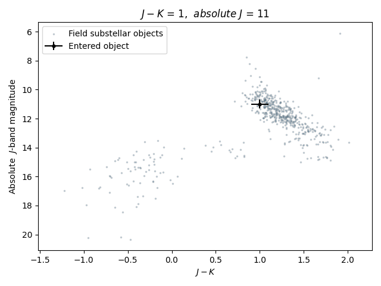
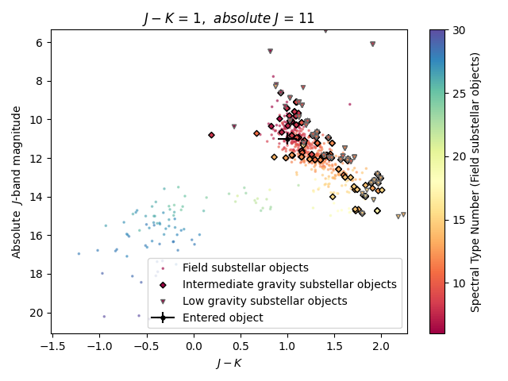
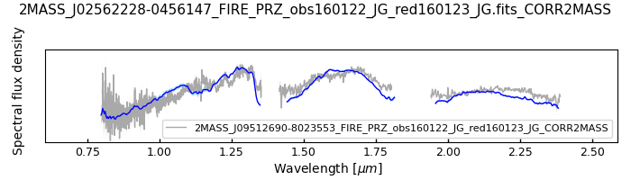
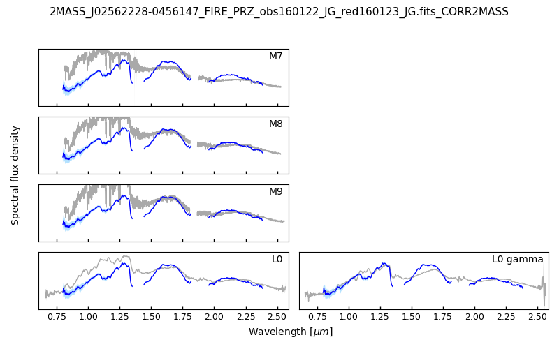

mocapy
======

**A Python package to interact with the MOCA database**

The latest version of this package was only tested with Python 3.12.3 installed with a Mac M1-native conda setup.

You can install this package with the following command::

    pip install git+https://github.com/jgagneastro/mocapy.git

One the package is installed, it is *imperative* to create a Python environment or a conda environment dedicated to its use, and install the exact versions of the packages that were used in its development. This is true because several Python packages will change over time in a non-retrocompatible way.

In order to create your own Python environment, open a terminal, navigate somewhere you will remember (e.g. your mocapy directory), and enter the following command::

    python -m venv mocapy_env

This will create a mocapy_env directory where the exact versions of the Python packages required by mocapy will be stored without interfering with your system installations. Once this is done, you need to activate this virtual environment with the follwing terminal command::

    source mocapy_env/bin/activate

Alternatively, you can create a conda environment for mocapy and then install the package inside that environment with::

    conda create --name mocapy_env python==3.12.3
	conda activate mocapy_env
	pip install git+https://github.com/jgagneastro/mocapy.git

Note that you can choose your own environment name instead of mocapy_env.

Once this is done, you should see that your command line now stars with the "(mocapy_env) " flag before the usual prompts. 

If you have downloaded the GitHub repository instead of installing it, you need to add it to your PYTHONPATH and then manually install all packages with the following command (here I am assuming you have navigated to the mocapy directory)::

    pip install -r requirements.txt

Instead of navigating to your mocapy installation directory, you can also alternatively just download the requirements file wherever your environment was created with something like wget (or manually download requirements.txt from this repo) and then install the contents::

    wget https://raw.githubusercontent.com/jgagneastro/mocapy/main/requirements.txt
    pip install -r requirements.txt

Once the packages are installed, you should be able to launch Python and use mocapy normally. Note every time you need to use mocapy, you should launch the same mocapy Python environment, by navigating wherever you have created it, and launching the same command again::

    source mocapy_env/bin/activate

If you used the conda environment instead of the pyenv environment, then you will do this instead (from anywhere)::

    conda activate mocapy_env

Documentation
-------------

The full documentation for this project is not yet available.

The following Python command lines will allow you to download data from the MOCA database using raw MySQL syntax::
    
    #Import the mocapy package
    from mocapy import *

    #Create a moca engine object
    moca = MocaEngine()
    
    #Query the moca database to obtain a Pandas DataFrame
    df = moca.query("SELECT * FROM moca_objects LIMIT 20")
    
    #See the outputs of the DataFrame
    print(df)

You can also upload your own table to the database (as a temporary table) and use it to cross-match any database entries. In this example, we will use the previous df DataFrame which we downloaded from MOCAdb, but you could use any dataframe::

    #Query the moca database again, but this time upload your own pandas DataFrame to cross-match against the database
    dfnew = moca.query("SELECT * FROM cdata_spectral_types JOIN tmp_table USING(moca_oid)",tmp_table=df)
    
    #See the outputs of the second DataFrame
    print(dfnew)

If you would like to use your own list of stellar designations, we have provided an example file in /docs/star_designations.csv, which you can use with the following example::

    # Import the necessary packages
    from mocapy import *
    import pandas as pd
    
    # Initiate a connection to the MOCA database
    moca = MocaEngine()
    
    # Locate the file with the stellar designations
    # Make sure the first line here has the word "designation" to indicate the column containing the stellar designations
    file = "/mocapy/docs/star_designations.csv"
    
    # Read the list of designations in a pandas DataFrame
    df = pd.read_csv(file)
    
    # Launch a query to MOCA joining the table "mechanics_all_designations" on your own list of stellar designations upon exact but case-insensitive matches (using the LIKE MySQL statement) in order to resolve the MOCA_OID unique identifiers, and use these moca_oid to join the summary_all_objects table containing best membership and other useful informations
    mdf = moca.query("SELECT tt.designation AS input_designation, sam.* FROM tmp_table AS tt LEFT JOIN mechanics_all_designations AS mad ON(mad.designation LIKE tt.designation) LEFT JOIN summary_all_objects AS sam ON(sam.moca_oid=mad.moca_oid)", tmp_table=df)
    
    # Display mdf summary
    print(mdf)

You should get an output similar to this::

    input_designation  moca_oid moca_aid moca_mtid  ...    gaiadr3_source_id                                   all_designations                                    designation_url  mtid_level
    0            AU Mic   10946.0     BPMG         BF  ...  6794047652729201024  MCC 824|Gaia EDR3 6794047652729201024|TYC 7457...  <a href=https://mocadb.ca/search/results?searc...         0.0
    1            HD 952  501711.0     None      None  ...  2863577296085970816  Gaia EDR3 2863577296085970816|TIC 365934195|2M...  <a href=https://mocadb.ca/search/results?searc...         NaN
    2    Barnard's Star       NaN     None      None  ...                 None                                               None                                               None         NaN
    3            HIP 12       NaN     None      None  ...                 None                                               None                                               None         NaN
    
    [4 rows x 191 columns]

In this example, the last two stars did not have a match in the MOCA database, and thus the pandas DataFrame contains missing values.

Visualizing spectra and color-magnitude diagrams
-----------------------

**Get_cmd** is a MOCA tool that plots a color-magnitude diagram (the absolute M band magnitude as a function of the difference between the magnitudes of m1 and m2 bands) of the database field brown dwarfs sequence and overplots a manually entered object. For the moment, the use of this tool requires *collaborators* access to the database.

To overplot the entered object, the difference of m1 and m2 and the absolute magnitude of band M must be provided as *m1m2* and *M*, respectively, along with their uncertainties as *em1m2* and *eM*. 

Each m1, m2 and M band can be specified using the exact unique photometry system identifier (*moca_psid*) of the moca_photometry_systems table or, more generally, the terms *"j_any"*, *"h_any"* and *"k_any"*. The bands are specified as strings through the variables *m1_type*, *m2_type* and *M_type*.

Some parameters can also be added to the CMD::

    spt : (bool) Plot the spectral types of the field BD reference sequence (default = False)
    young_objs : (bool) Plot the intermediate and low gravity substellar objects over the field reference sequence (default = False)
    ref_err : (bool) Plot the error bars of the field BD reference sequence (default = False)
    xmin, xmax = x-axis range (default = None, the range is automatically estimated)
    ymin, ymax = y-axis range (default = None, the range is automatically estimated)
    path = Path for saving the figure (default = None)
    con = Connection to the database

To set the connection, add the right environment parameters *moca_username*, *moca_password*, *moca_host* and *moca_dbname* following the *engine* command below and provide this connection to get_cmd through the parameter *con*. If no connection is specified, the default public connection is used, which does not give the access to the tool yet.

The following Python command will allow you to compare the magnitudes M and m1m2 of the entered object with the field brown dwarf sequence::

    #Import the mocapy package
    import mocapy
    from mocapy import MocaEngine
    from mocapy import MocaViz
    from sqlalchemy import create_engine

    #Set the MOCA connection (as collaborators for now) :
    engine = create_engine("mysql+pymysql://"+moca_username+":"+urlquote(moca_password)+"@"+moca_host+"/"+moca_dbname)
    con = engine.connect()

    #Create a mocaViz object
    mocaviz = MocaViz()

    #Call the function get_cmd :
    mocaviz.get_cmd(m1m2, M, em1m2, eM, m1_type, m2_type, M_type, spt, young_objs, ref_err, xmin, xmax, ymin, ymax, path, con)

For example, to plot an entered object with an absolute magnitude in the band *mko_jmag* and difference between the bands *mko_jmag* and *mko_kmag* equal to 11 and 1, respectively, and their uncertainties over the sequence, you can use the following command::

    mocaviz.get_cmd(1, 11, 0.1, 0.3, "mko_jmag", "mko_kmag", "mko_jmag", con = con)

If you want to plot this object over the sequence showing the spectral types and the young objects (low to intermediate gravity), you can use the parameters *spt* and *young_seq*::

    mocaviz.get_cmd(1, 11, 0.1, 0.3, "mko_jmag", "mko_kmag", "mko_jmag", spt = True, young_seq = True, con = con)

**Get_spectrum** is a MOCA tool that plots the spectrum of the provided target as is or over a second target or MOCA database spectrum type reference models. For the moment, the use of this tool requires collaborators access to the database.

To display the spectrum of an object, either its designation or its unique spectrum identifier for the MOCA database (*moca_specid*) as *moca_specid* and *designation* must be provided. To add a background target spectrum, its moca_specid or designation must be specified as *moca_specid2* and *designation2*. 

To set the connection, add the appropriate environment parameters *moca_username*, *moca_password*, *moca_host* and *moca_dbname* following the *engine* command below and provide this connection to get_spectrum through the parameter *con*. If no connection is specified, the default public connection is used, which does not yet give the access to the tool.

The following Python command will allow you to display the spectrum::

    #Import the mocapy package
    import mocapy
    from mocapy import MocaEngine
    from mocapy import MocaViz

    #Set the database connection creditials - here, we are using a custom connection because the MocaViz package is currently in beta phase and only available for internal collaborators (it will become public soon). Therefore, if you are part of the collaboration you can replace the credentials below. Once MocaViz is fully released, replacing the Moca connection as below will not be necessary.

    moca_host = "mocadb.ca"
    moca_dbname = "mocadb"
    moca_username = "public"
    moca_password = "z@nUg_2h7_%?31y88"
    
    #Set the Moca connection (as collaborators for now) :
    from urllib.parse import quote_plus as urlquote
    from sqlalchemy import create_engine
    engine = create_engine("mysql+pymysql://"+moca_username+":"+urlquote(moca_password)+"@"+moca_host+"/"+moca_dbname)
    con = engine.connect()

    #Create a mocaViz object
    mocaviz = MocaViz()

    #Call the function get_spectrum :
    mocaviz.get_spectrum(moca_specid, designation, moca_specid2, designation2, spt_ref, sptn_int, gravity_class, path, con)

For example, to plot two spectra from moca_specids 500 and 527, the command would be::

    mocaviz.get_spectrum(moca_specid = 500, moca_specid2 = 527, con = con)

You can also plot the target spectrum over reference spectra of given or automatic spectral type number interval by specifying spt_ref = True. If not specified, this parameter is False and the reference spectra are not displayed. The parameter sptn_int allows you to provide a specific interval of spectral type numbers, where 0 is M0, 10 is L0 and -10 is K0, as a list. The gravity class or classes ('alpha', 'beta' or 'gamma') can also be specified as a list of strings to the parameter gravity_class. The default sptn_int and gravity_class are [7, 20], ['alpha', 'beta', 'gamma'], respectively. 

For example, the command could be::

    mocaviz.get_spectrum(moca_specid = 500, spt_ref = True, sptn_int = [7, 10], gravity_class = ['alpha', 'gamma'], con = con)

Instead of plotting the spectrum/spectra, you can use the keyword *return_data = True* when calling *get_spectrum* to return the spectrum/spectra as Pandas dataFrames. 

The command could be ::

    df = mocaviz.get_spectrum(moca_specid = 500, return_data = True, con = con)

Or ::

    df1, df2 = mocaviz.get_spectrum(moca_specid = 500, moca_specid2 = 527, return_data = True, con = con)

The output spectrum is given by the columns *lam* (wavelength), *sp* (flux) and *esp* (flux_unc). The flux units are given in the column *flux_units*.

More details about MOCA
-----------------------

This section will eventually be translated from French and gives more details about the MOCA database and how it can be used.

I’m putting here some information about the young-star database, the “Montreal Open Clusters and Associations” database, or MOCA database. It uses the MySQL language, which is very well documented online.

The database is fairly complete out to 500 pc, but I recently started adding somewhat more distant open clusters as well. It also contains almost all known brown dwarfs.

To use it, download the Sequel Ace app from the Mac App Store, then use the following information. Please do not share these details, because the database is not public yet:

MySQL host : mocadb.ca
MySQL database : mocadb
MySQL username : public
MySQL password : z@nUg_2h7_%?31y88

You can then browse the tables listed on the left and change modes with the buttons in the top toolbar. “Structure” gives you access to the columns of a table and their types. See “Comments” for a description of the columns, although I have not finished documenting them all yet. “Contents” shows you the first rows of the table contents, which you can filter using the small funnel button at the bottom of the table. “Query” lets you run SQL queries, view the results, and download them as CSV files if needed. There is also a “Table Info” button that lets you see a description of each table.

You also have access to the “mocadb_private_tables” database via the dropdown menu at the top, which also contains unpublished data. I am actively working on this database, so it is changing a lot right now. The default database, “mocadb”, is a fixed snapshot from around June 10, 2022. It will eventually be generated automatically from “mocadb_private_tables”, while omitting private data, once I have finished building the infrastructure.

You can communicate directly with the database using the Python packages pandas and sqlalchemy. However, if you enter the password as a string directly in your code, you will need to transform certain symbols for it to work correctly. A Google search will give you more information about this. See in particular the pandas function read_sql.

In the database, the moca_* columns are useful for connecting tables together with JOIN. For example, moca_oid is a unique identifier for each star, moca_aid is a unique identifier for each association, and moca_pid is a unique identifier for scientific publications.

The database contains a few procedures and functions, which are listed under the tables. The ones that start with “engine_” in the private database are used for updating the data, and you will not be able to run them. You can call the other functions in the SQL Query view with the following syntax:

CALL function_name(input);

Here are a few useful functions:

REPORT: obtain an overview of the information related to a star from its name. Use % as a wildcard, but avoid starting the name with a wildcard, otherwise the query will be very slow. Example:

CALL REPORT('SIMP%0136%');

GAIAREPORT: similar, but works only with Gaia source_id values, for all data releases. This is faster than using REPORT with a wildcard.

IDREPORT: similar, but takes an integer moca_oid as input.

AREPORT: obtain an overview of the information related to a stellar association from its name. Example:

CALL AREPORT('AB Dor%');

AIDREPORT: similar, but takes a moca_aid string as input.

The database tables have prefixes that indicate the type of table:

cat_ tables are sections of astronomical catalogs, such as Gaia or 2MASS. They are downloaded as-is from astronomical servers for the stars present in MOCAdb.

data_ tables contain raw data from the literature, typically related to a star or an association. Some of these data are imported automatically and periodically from the cat_ tables by the MOCAdb infrastructure. Others are downloaded directly from VizieR or from scientific papers.

calc_ tables contain values calculated automatically by the MOCAdb infrastructure. Sometimes these are combinations of all available measurements for a star, and sometimes they are new quantities.

cdata_ tables contain a mix of literature data, typically with a non-null moca_pid, and calculations done by MOCAdb, typically with a non-null md5_uid.

mechanics_ tables contain tables generated automatically by MOCAdb that involve combinations of other tables in the database, but not necessarily calculations.

summary_ tables contain summary tables that group data from a set of other tables in the database.

priv_ tables contain unpublished tables.

pcat_ tables contain private, unpublished catalogs.

You also have access to astronomical sequences, such as color-magnitude sequences or mass versus spectral type sequences, described in the table moca_astrophysical_sequences. Choose the moca_seqid that interests you from that table, then retrieve the data from the table data_astrophysical_sequences by selecting only the rows that have that moca_seqid value. You will then have your sequence.

Here are a few examples of SQL code:

SELECT *
FROM mechanics_all_designations
WHERE designation LIKE "SIMP%0136%";

This query will allow you to retrieve the moca_oid of SIMP0136 by looking through the compilation of all designations in the database. Note that line breaks are optional. The SELECT * part means that I want to retrieve all columns of the table in my result.

SELECT *
FROM mechanics_all_designations
INNER JOIN cdata_spectral_types USING(moca_oid)
WHERE designation LIKE "SIMP%0136%";

This query will join to your result all spectral type measurements associated with SIMP0136 in the database. Note that INNER JOIN can also simply be written JOIN. The USING clause means that you will join rows for which moca_oid is identical. This clause can also be replaced by ON(mechanics_all_designations.moca_oid=cdata_spectral_types.moca_oid), which could contain more complex logical tests if desired. Also note that JOIN operations using indexed columns in the database, such as moca_oid, will be very fast, but JOIN operations performed on non-indexed columns will be much slower. Indexes take disk space, and I have generally only built them for the moca_* columns.

SELECT *
FROM mechanics_all_designations
INNER JOIN cdata_spectral_types USING(moca_oid)
WHERE designation LIKE "SIMP%";

This query will allow you to obtain a list of all objects with a SIMP designation, along with their spectral types. Each object for which multiple spectral types have been published will appear on multiple rows. To obtain only one spectral type, one could use:

SELECT mad.designation, spt.moca_oid, spt.spectral_type
FROM mechanics_all_designations AS mad
INNER JOIN cdata_spectral_types AS spt USING(moca_oid)
WHERE designation LIKE "SIMP%"
GROUP BY mad.moca_oid;

Here, I have specified aliases for the tables, mad and spt, to simplify the query. The word AS could be omitted entirely. I also used GROUP BY to combine together all rows with the same moca_oid. Note that the order of the clauses matters: WHERE must follow all JOIN clauses and come before GROUP BY. As written, this command will return any available spectral type value, without any preference. Also note that I only selected a few columns in this query. I could also concatenate all published spectral type values as follows:

SELECT mad.designation, spt.moca_oid, GROUP_CONCAT(spt.spectral_type) AS all_spts
FROM mechanics_all_designations AS mad
INNER JOIN cdata_spectral_types AS spt USING(moca_oid)
WHERE designation LIKE "SIMP%"
GROUP BY mad.moca_oid;

One could also retrieve only the most recent spectral type for each object by using the publication date in the moca_publications table, which will be joined using the moca_pid associated with each spectral type measurement:

SELECT mad.designation, spt.moca_oid, spt.spectral_type, mp.moca_pid, mp.pubdate
FROM mechanics_all_designations AS mad
INNER JOIN cdata_spectral_types AS spt USING(moca_oid)
INNER JOIN moca_publications AS mp ON(mp.moca_pid=spt.moca_pid)
WHERE designation LIKE "SIMP%";

Note that in a situation like this, where more than two tables already have a moca_pid column, we were forced to replace USING with ON and specify which tables’ moca_pid columns should be connected. Indeed, mechanics_all_designations and cdata_spectral_types can each be associated with a publication.

Here, I did not immediately use GROUP BY. I only retrieved the publication year for each spectral type. One of the biggest limitations of MySQL is the impossibility of selecting all columns associated with the maximum value of a specific column using GROUP BY. One might be tempted to try the following command:

SELECT mad.designation, spt.moca_oid, spt.spectral_type, mp.moca_pid, MAX(mp.pubdate)
FROM mechanics_all_designations AS mad
INNER JOIN cdata_spectral_types AS spt USING(moca_oid)
INNER JOIN moca_publications AS mp ON(mp.moca_pid=spt.moca_pid)
WHERE designation LIKE "SIMP%"
GROUP BY mad.moca_oid;

Although this command will give us the most recent year associated with the spectral types of each object, there is no guarantee that the spectral type value itself comes from that same publication. To fix this situation, we are forced to work around the problem in a slightly less elegant way, by constructing a kind of row number, which we will call sptrowid, for the spectral types of each object individually. This number will therefore go from 1 to N for an object with N spectral type measurements, while making sure to order the publications from the most recent to the oldest. The following command will allow us to obtain sptrowid:

ROW_NUMBER() OVER(PARTITION BY moca_oid ORDER BY mp.pubdate DESC) AS sptrowid

Thus:

SELECT mad.designation, spt.moca_oid, spt.spectral_type, mp.moca_pid, mp.pubdate, ROW_NUMBER() OVER(PARTITION BY moca_oid ORDER BY mp.pubdate DESC) AS sptrowid
FROM mechanics_all_designations AS mad
INNER JOIN cdata_spectral_types AS spt USING(moca_oid)
INNER JOIN moca_publications AS mp ON(mp.moca_pid=spt.moca_pid)
WHERE designation LIKE "SIMP%";

This will then allow us to select only the rows with sptrowid=1, but we will be forced to apply this filter in a separate second step, because MySQL does not allow us to directly filter the sptrowid values constructed with ROW_NUMBER() OVER(…). This is an unfortunate constraint of this type of function, which is called a window function. We can apply the filter with the following command:

SELECT * FROM
(
    SELECT mad.designation, spt.moca_oid, spt.spectral_type, mp.moca_pid, mp.pubdate, ROW_NUMBER() OVER(PARTITION BY moca_oid ORDER BY mp.pubdate DESC) AS sptrowid
    FROM mechanics_all_designations AS mad
    INNER JOIN cdata_spectral_types AS spt USING(moca_oid)
    INNER JOIN moca_publications AS mp ON(mp.moca_pid=spt.moca_pid)
    WHERE designation LIKE "SIMP%"
) AS subquery
WHERE sptrowid=1;

Note that MySQL starts row identifiers at 1 and not zero. In addition, MySQL forces us to assign an alias to any table that results from a query nested within another query.

We can also use the ORDER BY clause to reorder the rows. For example, if we want to order them by spectral type, we must use the column containing the numerical spectral type to do it correctly:

SELECT * FROM
(
    SELECT mad.designation, spt.moca_oid, spt.spectral_type, mp.moca_pid, mp.pubdate, ROW_NUMBER() OVER(PARTITION BY moca_oid ORDER BY mp.pubdate DESC) AS sptrowid
    FROM mechanics_all_designations AS mad
    INNER JOIN cdata_spectral_types AS spt USING(moca_oid)
    INNER JOIN moca_publications AS mp ON(mp.moca_pid=spt.moca_pid)
    WHERE designation LIKE "SIMP%"
    ORDER BY spt.spectral_type_number
) AS subquery
WHERE sptrowid=1;

When using INNER JOIN or JOIN, MySQL will always ignore rows for which no match was found in the second table. If we want to keep SIMP objects for which no spectral type is available, we can use a LEFT OUTER JOIN, or LEFT JOIN for short:

SELECT mad.designation, spt.moca_oid, spt.spectral_type
FROM mechanics_all_designations AS mad
LEFT JOIN cdata_spectral_types AS spt USING(moca_oid)
WHERE designation LIKE "SIMP%";

We can also use this syntax to specifically select SIMP entries that do not have a spectral type:

SELECT mad.designation, spt.moca_oid, spt.spectral_type
FROM mechanics_all_designations AS mad
LEFT JOIN cdata_spectral_types AS spt USING(moca_oid)
WHERE designation LIKE "SIMP%" AND spt.spectral_type IS NULL;

We could also add all available proper motion measurements:

SELECT mad.designation, spt.moca_oid, spt.spectral_type, pm.pmra_masyr, pm.pmdec_masyr
FROM mechanics_all_designations AS mad
LEFT JOIN cdata_spectral_types AS spt USING(moca_oid)
LEFT JOIN data_proper_motions AS pm USING(moca_oid)
WHERE designation LIKE "SIMP%";

But you will notice that some of these objects have a large number of proper motion measurements. The MOCAdb database periodically chooses the most precise proper motion value for each star and assigns it the value 1 in the adopted column. We can therefore select only the best value with:

SELECT mad.designation, spt.moca_oid, spt.spectral_type, pm.pmra_masyr, pm.pmdec_masyr
FROM mechanics_all_designations AS mad
LEFT JOIN cdata_spectral_types AS spt USING(moca_oid)
LEFT JOIN data_proper_motions AS pm USING(moca_oid)
WHERE designation LIKE "SIMP%" AND pm.adopted=1;

Somewhat counterintuitively, it is generally much faster to filter in the WHERE clause at the end of the query than directly in the ON clause when adding the data_proper_motions table, or worse, in a subquery such as:

SELECT mad.designation, spt.moca_oid, spt.spectral_type, pm.pmra_masyr, pm.pmdec_masyr
FROM mechanics_all_designations AS mad
LEFT JOIN cdata_spectral_types AS spt USING(moca_oid)
LEFT JOIN (SELECT * FROM data_proper_motions WHERE adopted=1) AS pm USING(moca_oid)
WHERE designation LIKE "SIMP%";

This is true because MySQL will not necessarily execute in the order in which we listed the clauses. The language first builds an action plan to maximize performance, then executes only the required steps in the most efficient order it can find. When subqueries are nested inside parentheses, it is generally much more difficult for MySQL to interpret the code globally and find the best execution plan.

In another situation, we might want to retrieve a list of all stars in a young association. Let us take, for example, the AB Doradus moving group, for which moca_aid = ‘ABDMG’, as can be seen in the moca_associations table. Several options are available to us for building such a list. The simplest method would be to run a query in the data_memberships table, which contains all literature remarks concerning members of ABDMG:

SELECT *
FROM data_memberships
WHERE moca_aid='ABDMG';

We can also order the results by membership type, categorized in the moca_mtid column, for “membership type id”. The types are BF, HM, CM, LM, AM, and R, respectively for “bona fide”, “high likelihood candidate member”, “candidate member”, “low likelihood candidate member”, “ambiguous member”, and “rejected”. Bona fide members generally have complete 3D kinematics, UVW, and at least one sign of youth consistent with the age of the association. HM objects still need one or two such measurements, but all signs point toward a robust member. CM objects are candidates for which several pieces of information are still missing. LM objects are problematic candidates. AM objects are ambiguous between two young associations. R objects have been rejected as members. If we simply ordered the results according to these categories, we would not get a very desirable order, because it would simply be alphabetical:

SELECT *
FROM data_memberships
WHERE moca_aid='ABDMG'
ORDER BY moca_mtid;

We then end up with AM members, BF, CM, HM, LM, and finally R. It would be much more interesting to join the moca_membership_types table and order by the level column, which better corresponds to a degree of confidence:

SELECT dm.*
FROM data_memberships dm
JOIN moca_membership_types mt USING(moca_mtid)
WHERE dm.moca_aid='ABDMG'
ORDER BY mt.level DESC;

You may also notice that a single star could have been the subject of several studies that noted it was a member of ABDMG. We can highlight this even better by ordering by level, then by moca_oid for each level value:

SELECT dm.*
FROM data_memberships dm
JOIN moca_membership_types mt USING(moca_mtid)
WHERE dm.moca_aid='ABDMG'
ORDER BY mt.level DESC, dm.moca_oid;

To obtain a list of members without repetitions, we have two options. We could group by moca_oid, as follows:

SELECT dm.moca_oid, dm.moca_aid, GROUP_CONCAT(dm.moca_mtid) AS all_memtypes, GROUP_CONCAT(dm.moca_pid) AS all_publications
FROM data_memberships dm
WHERE dm.moca_aid='ABDMG'
GROUP BY dm.moca_oid;

However, by grouping all membership types together, we lose the ability to clearly separate the table into bona fide members, etc. This problem is difficult to solve, because a star categorized as bona fide in one scientific publication could be categorized differently in another. We could easily remove all stars that have been rejected at least once as follows:

SELECT dm.moca_oid, dm.moca_aid, GROUP_CONCAT(dm.moca_mtid) AS all_memtypes, GROUP_CONCAT(dm.moca_pid) AS all_publications
FROM data_memberships dm
WHERE dm.moca_aid='ABDMG'
GROUP BY dm.moca_oid
HAVING all_memtypes NOT LIKE '%R%';

Here, the HAVING clause is very similar to WHERE, but it applies after the execution of a GROUP BY. We must therefore use it if we want to filter using the result of a GROUP_CONCAT.

We could also retrieve all members that have been called “bona fide” at least once, as follows:

SELECT dm.moca_oid, dm.moca_aid, GROUP_CONCAT(dm.moca_mtid) AS all_memtypes, GROUP_CONCAT(dm.moca_pid) AS all_publications
FROM data_memberships dm
WHERE dm.moca_aid='ABDMG'
GROUP BY dm.moca_oid
HAVING all_memtypes LIKE '%BF%' AND all_memtypes NOT LIKE '%R%';

We could also concatenate these two lists one after the other by defining a new column to categorize them and using the UNION ALL clause to combine the rows of two queries into a single table:

SELECT "BF" AS category, dm.moca_oid, dm.moca_aid, GROUP_CONCAT(dm.moca_mtid) AS all_memtypes, GROUP_CONCAT(dm.moca_pid) AS all_publications
FROM data_memberships dm
WHERE dm.moca_aid='ABDMG'
GROUP BY dm.moca_oid
HAVING all_memtypes LIKE '%BF%' AND all_memtypes NOT LIKE '%R%'
UNION ALL SELECT "HM" AS category, dm.moca_oid, dm.moca_aid, GROUP_CONCAT(dm.moca_mtid) AS all_memtypes, GROUP_CONCAT(dm.moca_pid) AS all_publications
FROM data_memberships dm
WHERE dm.moca_aid='ABDMG'
GROUP BY dm.moca_oid
HAVING all_memtypes LIKE '%HM%' AND all_memtypes NOT LIKE '%R%' AND all_memtypes NOT LIKE '%BF%'
UNION ALL SELECT "CM" AS category, dm.moca_oid, dm.moca_aid, GROUP_CONCAT(dm.moca_mtid) AS all_memtypes, GROUP_CONCAT(dm.moca_pid) AS all_publications
FROM data_memberships dm
WHERE dm.moca_aid='ABDMG'
GROUP BY dm.moca_oid
HAVING all_memtypes NOT LIKE '%HM%' AND all_memtypes NOT LIKE '%BF%' AND all_memtypes NOT LIKE '%R%'
UNION ALL SELECT "R" AS category, dm.moca_oid, dm.moca_aid, GROUP_CONCAT(dm.moca_mtid) AS all_memtypes, GROUP_CONCAT(dm.moca_pid) AS all_publications
FROM data_memberships dm
WHERE dm.moca_aid='ABDMG'
GROUP BY dm.moca_oid
HAVING all_memtypes LIKE '%R%';

Another option would be to use the mechanics_best_memberships table, which contains only the most probable association for each star.

Sometimes, a young association can be part of a larger grouping of associations. For example, the Upper Scorpius, USCO, Lower Centaurus Crux, LCC, and Upper Centaurus Lupus, UCL, associations are all part of the Scorpius-Centaurus region, SCOCEN, as indicated in the moca_associations table via the parent_aid column. Thus, a star that is a member of USCO should consequently also appear among the members of SCOCEN, which can make it more difficult to build a complete list of SCOCEN. The mechanics_memberships_propagated table is useful in this situation, because all rows related to USCO will automatically have also been listed as members of SCOCEN by MOCAdb. We can therefore obtain a complete list of SCOCEN with:

SELECT dm.moca_oid, dm.moca_aid, GROUP_CONCAT(dm.moca_mtid) AS all_memtypes, GROUP_CONCAT(dm.moca_pid) AS all_publications
FROM mechanics_memberships_propagated dm
WHERE dm.moca_aid='SCOCEN'
GROUP BY dm.moca_oid
HAVING all_memtypes NOT LIKE '%R%';

Historically, this region was studied extensively before Gaia and therefore contains a large number of contaminants. We can remove many of these by joining the calc_banyan_sigma table, which contains the results of the BANYAN Sigma Bayesian analysis, and simply removing all entries whose velocity cannot be within 3 km/s of the young association that best matches it. This is a very conservative way to remove only the very problematic entries. When using the calc_banyan_sigma table, one must specify the algorithm version, the data that were used, with or without radial velocity and parallax, or simply take the most recent version that includes the most available data by specifying adopted=1:

SELECT dm.moca_oid, dm.moca_aid, cbs.best_hyp, GROUP_CONCAT(dm.moca_mtid) AS all_memtypes, GROUP_CONCAT(dm.moca_pid) AS all_publications
FROM mechanics_memberships_propagated dm
JOIN calc_banyan_sigma cbs USING(moca_oid)
WHERE dm.moca_aid='SCOCEN' AND cbs.adopted=1 AND cbs.uvw_sep<=3
GROUP BY dm.moca_oid
HAVING all_memtypes NOT LIKE '%R%';

In this list, we find several stars that were categorized in subgroups of USCO, LCC, EPSC, and ROPH, all of which are also part of SCOCEN, which is a good sign.

We can also apply another series of cuts contained in the data_rejected_membership_parameters table, which contains extremely conservative distance, position, or velocity limits for different associations or open clusters. These limits also make it possible to quickly filter the most problematic stars. This has already been done automatically by MOCAdb in the mechanics_memberships_vetted table, a filtered version of mechanics_memberships_propagated, and the mechanics_best_memberships_vetted table, a similar table but grouped by object via moca_oid.

Suppose that we now want to add our best estimate of the radial velocities of these objects. We could simply add the raw literature data with a JOIN on the data_radial_velocities table:

SELECT dm.moca_oid, dm.moca_aid, cbs.best_hyp, drv.radial_velocity_kms, drv.radial_velocity_kms_unc, drv.moca_pid AS rv_ref, drv.n_measurements, GROUP_CONCAT(dm.moca_mtid) AS all_memtypes, GROUP_CONCAT(dm.moca_pid) AS all_publications
FROM mechanics_memberships_propagated dm
JOIN calc_banyan_sigma cbs USING(moca_oid)
JOIN data_radial_velocities drv USING(moca_oid)
WHERE dm.moca_aid='SCOCEN' AND cbs.adopted=1 AND cbs.uvw_sep<=3
GROUP BY dm.moca_oid
HAVING all_memtypes NOT LIKE '%R%';

However, some objects will be duplicated many times when several radial velocity measurements are available, and the GROUP BY clause will arbitrarily select one of the available radial velocities. We can choose to view all radial velocities by adding data_radial_velocities after the GROUP BY, but since this does not respect the order of MySQL clauses, we need two queries:

SELECT drv.radial_velocity_kms, drv.radial_velocity_kms_unc, drv.moca_pid AS rv_ref, drv.n_measurements, subt.*
FROM
(
    SELECT dm.moca_oid, dm.moca_aid, cbs.best_hyp, GROUP_CONCAT(dm.moca_mtid) AS all_memtypes, GROUP_CONCAT(dm.moca_pid) AS all_publications
    FROM mechanics_memberships_propagated dm
    JOIN calc_banyan_sigma cbs USING(moca_oid)
    WHERE dm.moca_aid='SCOCEN' AND cbs.adopted=1 AND cbs.uvw_sep<=3
    GROUP BY dm.moca_oid
    HAVING all_memtypes NOT LIKE '%R%'
) subt
JOIN data_radial_velocities drv USING(moca_oid);

This time, we will see all radial velocity measurements from the literature. Note that I would not have been able to join with moca_oid on the subt subquery if I had not retrieved the moca_oid column in the internal SELECT.

The radial velocities of a star can vary considerably over time if it is a binary star, for example. It could therefore be useful to combine all radial velocities from the literature, but doing this properly is not at all obvious, because some radial velocities may have been taken on the same date, with completely different uncertainties, or may combine a different number of measurements, as indicated by n_measurements. MOCAdb has in fact already automatically combined all radial velocities for each moca_oid in order to obtain the most reliable possible estimate of the median velocity over time, taking into account the error bars and n_measurements, first grouping radial velocities taken on the same date, specifying a floor on the precision of absolute radial velocity measurements, and avoiding combining redundant measurements such as those from Gaia DR2 and DR3. These values are available in the calc_radial_velocities_combined table, so it is more interesting to use that table:

SELECT dm.moca_oid, dm.moca_aid, cbs.best_hyp, drv.radial_velocity_kms, drv.radial_velocity_kms_unc, drv.all_pids AS rv_refs, drv.n_measurements, GROUP_CONCAT(dm.moca_mtid) AS all_memtypes, GROUP_CONCAT(dm.moca_pid) AS all_publications
FROM mechanics_memberships_propagated dm
JOIN calc_banyan_sigma cbs USING(moca_oid)
JOIN calc_radial_velocities_combined drv USING(moca_oid)
WHERE dm.moca_aid='SCOCEN' AND cbs.adopted=1 AND cbs.uvw_sep<=3
GROUP BY dm.moca_oid
HAVING all_memtypes NOT LIKE '%R%';

We can also use the calc_radial_velocities_corrected table, which includes gravitational redshift and convective redshift corrections, applied automatically by MOCAdb using the objects’ spectral types:

SELECT dm.moca_oid, dm.moca_aid, cbs.best_hyp, drv.radial_velocity_kms, drv.radial_velocity_kms_unc, drv.all_pids AS rv_refs, drv.n_measurements, GROUP_CONCAT(dm.moca_mtid) AS all_memtypes, GROUP_CONCAT(dm.moca_pid) AS all_publications
FROM mechanics_memberships_propagated dm
JOIN calc_banyan_sigma cbs USING(moca_oid)
JOIN calc_radial_velocities_corrected drv USING(moca_oid)
WHERE dm.moca_aid='SCOCEN' AND cbs.adopted=1 AND cbs.uvw_sep<=3
GROUP BY dm.moca_oid
HAVING all_memtypes NOT LIKE '%R%';

One could even imagine building a list for telescope follow-up, which might lead us to apply photometric cuts. This can be done either by directly joining astronomical catalogs, for example cat_gaiadr3 or cat_2mass, and using the appropriate columns, or by using the cdata_photometry table, which contains photometric values from several catalogs, corrected for extinction due to interstellar dust. You can consult moca_photometry_systems to choose the desired magnitude, using the moca_psid column, for example gaiaedr3_gmag, the Gaia EDR3 G magnitude, identical to Gaia DR3. If we wanted to cut objects with G > 12 and ignore those without a Gaia magnitude, we would therefore do:

SELECT dm.moca_oid, ROUND(phot.magnitude,1) AS gmag, dm.moca_aid, cbs.best_hyp, drv.radial_velocity_kms, drv.radial_velocity_kms_unc, drv.all_pids AS rv_refs, drv.n_measurements, GROUP_CONCAT(dm.moca_mtid) AS all_memtypes, GROUP_CONCAT(dm.moca_pid) AS all_publications
FROM mechanics_memberships_propagated dm
JOIN calc_banyan_sigma cbs USING(moca_oid)
JOIN calc_radial_velocities_corrected drv USING(moca_oid)
JOIN cdata_photometry phot USING(moca_oid)
WHERE dm.moca_aid='SCOCEN' AND cbs.adopted=1 AND cbs.uvw_sep<=3 AND phot.moca_psid='gaiaedr3_gmag' AND phot.magnitude<=12
GROUP BY dm.moca_oid
HAVING all_memtypes NOT LIKE '%R%';

We could also decide to remove all objects with spectral types later than K5, using the spectral_type_number column from the cdata_spectral_types table. Spectral type numbers are zero for M0, -10 for K0, +10 for L0, etc., so -5 for K5:

SELECT dm.moca_oid, spt.spectral_type, ROUND(phot.magnitude,1) AS gmag, dm.moca_aid, cbs.best_hyp, drv.radial_velocity_kms, drv.radial_velocity_kms_unc, drv.all_pids AS rv_refs, drv.n_measurements, GROUP_CONCAT(dm.moca_mtid) AS all_memtypes, GROUP_CONCAT(dm.moca_pid) AS all_publications
FROM mechanics_memberships_propagated dm
JOIN calc_banyan_sigma cbs USING(moca_oid)
JOIN calc_radial_velocities_corrected drv USING(moca_oid)
JOIN cdata_spectral_types spt USING(moca_oid)
JOIN cdata_photometry phot USING(moca_oid)
WHERE dm.moca_aid='SCOCEN' AND cbs.adopted=1 AND cbs.uvw_sep<=3 AND phot.moca_psid='gaiaedr3_gmag' AND phot.magnitude<=12 AND spt.adopted=1 AND spt.spectral_type_number < -5
GROUP BY dm.moca_oid
HAVING all_memtypes NOT LIKE '%R%';

Note that here we used only the best available spectral types, meaning those with adopted=1.

We could also search only for objects that are not too close to the celestial south pole with a constraint on declination, for example if our telescope cannot reach them. We could either use the data_equatorial_coordinates table, which contains all available coordinates for each star, or simply use the approximate coordinates cataloged in the moca_objects table, as follows:

SELECT dm.moca_oid, spt.spectral_type, ROUND(phot.magnitude,1) AS gmag, dm.moca_aid, cbs.best_hyp, drv.radial_velocity_kms, drv.radial_velocity_kms_unc, drv.all_pids AS rv_refs, drv.n_measurements, GROUP_CONCAT(dm.moca_mtid) AS all_memtypes, GROUP_CONCAT(dm.moca_pid) AS all_publications
FROM mechanics_memberships_propagated dm
JOIN moca_objects mo USING(moca_oid)
JOIN calc_banyan_sigma cbs USING(moca_oid)
JOIN calc_radial_velocities_corrected drv USING(moca_oid)
JOIN cdata_spectral_types spt USING(moca_oid)
JOIN cdata_photometry phot USING(moca_oid)
WHERE dm.moca_aid='SCOCEN' AND cbs.adopted=1 AND cbs.uvw_sep<=3 AND phot.moca_psid='gaiaedr3_gmag' AND phot.magnitude<=12 AND spt.adopted=1 AND spt.spectral_type_number < -5 AND mo.dec>-70
GROUP BY dm.moca_oid
HAVING all_memtypes NOT LIKE '%R%';

We might also be building a list of stars to search for exoplanets, and we may want to avoid binary stars. There are many approaches for identifying binary stars, and several of them have already been applied manually or automatically by MOCAdb in the data_object_properties table. We can therefore add a column to our list of stars that will contain all special properties identified in the database:

SELECT dm.moca_oid, GROUP_CONCAT(DISTINCT op.property_name) AS properties, spt.spectral_type, ROUND(phot.magnitude,1) AS gmag, dm.moca_aid, cbs.best_hyp, drv.radial_velocity_kms, drv.radial_velocity_kms_unc, drv.all_pids AS rv_refs, drv.n_measurements, GROUP_CONCAT(dm.moca_mtid) AS all_memtypes, GROUP_CONCAT(dm.moca_pid) AS all_publications
FROM mechanics_memberships_propagated dm
JOIN moca_objects mo USING(moca_oid)
JOIN calc_banyan_sigma cbs USING(moca_oid)
JOIN calc_radial_velocities_corrected drv USING(moca_oid)
JOIN cdata_spectral_types spt USING(moca_oid)
JOIN cdata_photometry phot USING(moca_oid)
LEFT JOIN data_object_properties op USING(moca_oid)
WHERE dm.moca_aid='SCOCEN' AND cbs.adopted=1 AND cbs.uvw_sep<=3 AND phot.moca_psid='gaiaedr3_gmag' AND phot.magnitude<=12 AND spt.adopted=1 AND spt.spectral_type_number < -5 AND mo.dec>-70
GROUP BY dm.moca_oid
HAVING all_memtypes NOT LIKE '%R%';

Here, we used a LEFT JOIN, because we would not want to ignore stars without special properties.

We can see here that several stars are unresolved binaries, or ordinary binaries, which we can choose to ignore via the HAVING clause, because here we are filtering on a result of the GROUP BY:

SELECT dm.moca_oid, GROUP_CONCAT(DISTINCT op.property_name) AS properties, spt.spectral_type, ROUND(phot.magnitude,1) AS gmag, dm.moca_aid, cbs.best_hyp, drv.radial_velocity_kms, drv.radial_velocity_kms_unc, drv.all_pids AS rv_refs, drv.n_measurements, GROUP_CONCAT(dm.moca_mtid) AS all_memtypes, GROUP_CONCAT(dm.moca_pid) AS all_publications
FROM mechanics_memberships_propagated dm
JOIN moca_objects mo USING(moca_oid)
JOIN calc_banyan_sigma cbs USING(moca_oid)
JOIN calc_radial_velocities_corrected drv USING(moca_oid)
JOIN cdata_spectral_types spt USING(moca_oid)
JOIN cdata_photometry phot USING(moca_oid)
LEFT JOIN data_object_properties op USING(moca_oid)
WHERE dm.moca_aid='SCOCEN' AND cbs.adopted=1 AND cbs.uvw_sep<=3 AND phot.moca_psid='gaiaedr3_gmag' AND phot.magnitude<=12 AND spt.adopted=1 AND spt.spectral_type_number < -5 AND mo.dec>-70
GROUP BY dm.moca_oid
HAVING all_memtypes NOT LIKE '%R%' AND properties NOT LIKE '%binary%';

Note here that we end up eliminating all entries with properties = NULL. This is a somewhat surprising feature of MySQL at first: any Boolean criterion will reject NULL values. We must therefore explicitly re-include them with an OR:

SELECT dm.moca_oid, GROUP_CONCAT(DISTINCT op.property_name) AS properties, spt.spectral_type, ROUND(phot.magnitude,1) AS gmag, dm.moca_aid, cbs.best_hyp, drv.radial_velocity_kms, drv.radial_velocity_kms_unc, drv.all_pids AS rv_refs, drv.n_measurements, GROUP_CONCAT(dm.moca_mtid) AS all_memtypes, GROUP_CONCAT(dm.moca_pid) AS all_publications
FROM mechanics_memberships_propagated dm
JOIN moca_objects mo USING(moca_oid)
JOIN calc_banyan_sigma cbs USING(moca_oid)
JOIN calc_radial_velocities_corrected drv USING(moca_oid)
JOIN cdata_spectral_types spt USING(moca_oid)
JOIN cdata_photometry phot USING(moca_oid)
LEFT JOIN data_object_properties op USING(moca_oid)
WHERE dm.moca_aid='SCOCEN' AND cbs.adopted=1 AND cbs.uvw_sep<=3 AND phot.moca_psid='gaiaedr3_gmag' AND phot.magnitude<=12 AND spt.adopted=1 AND spt.spectral_type_number < -5 AND mo.dec>-70
GROUP BY dm.moca_oid
HAVING all_memtypes NOT LIKE '%R%' AND (properties NOT LIKE '%binary%' OR properties IS NULL);

We might also want to impose constraints on the stellar activity of our sample, which can be done with certain spectral indices such as log_rprime_hk, described in the moca_spectral_indices table, whose values are available in data_spectral_indices. We can therefore retrieve the mean log_rhk value per star, when available:

SELECT AVG(dsi.index_value) AS logrhkmean, dm.moca_oid, GROUP_CONCAT(DISTINCT op.property_name) AS properties, spt.spectral_type, ROUND(phot.magnitude,1) AS gmag, dm.moca_aid, cbs.best_hyp, drv.radial_velocity_kms, drv.radial_velocity_kms_unc, drv.all_pids AS rv_refs, drv.n_measurements, GROUP_CONCAT(dm.moca_mtid) AS all_memtypes, GROUP_CONCAT(dm.moca_pid) AS all_publications
FROM mechanics_memberships_propagated dm
JOIN moca_objects mo USING(moca_oid)
JOIN calc_banyan_sigma cbs USING(moca_oid)
JOIN calc_radial_velocities_corrected drv USING(moca_oid)
JOIN cdata_spectral_types spt USING(moca_oid)
JOIN cdata_photometry phot USING(moca_oid)
LEFT JOIN data_object_properties op USING(moca_oid)
LEFT JOIN data_spectral_indices dsi USING(moca_oid)
WHERE dm.moca_aid='SCOCEN' AND cbs.adopted=1 AND cbs.uvw_sep<=3 AND phot.moca_psid='gaiaedr3_gmag' AND phot.magnitude<=12 AND spt.adopted=1 AND spt.spectral_type_number < -5 AND mo.dec>-70 AND (dsi.moca_siid='log_rprime_hk' OR dsi.moca_siid IS NULL)
GROUP BY dm.moca_oid
HAVING all_memtypes NOT LIKE '%R%' AND (properties NOT LIKE '%binary%' OR properties IS NULL);

We could then add constraints on logrhkmean in the HAVING clause.

Suppose that we now want to create a new table with the query above in order to perform other operations on it. MOCAdb users do not have permission to create new permanent tables, but temporary tables can be added. They will not be listed on the left by Sequel Ace, and they will disappear as soon as you disconnect. In MySQL, unfortunately, we must first prepare the columns of the temporary table as follows:

DROP TEMPORARY TABLE IF EXISTS tmp_targets;
CREATE TEMPORARY TABLE tmp_targets (logrhkmean FLOAT, moca_oid INT, properties TEXT, spectral_type TEXT, gmag FLOAT, moca_aid TEXT, best_hyp TEXT, radial_velocity_kms FLOAT, radial_velocity_kms_unc FLOAT, rv_refs TEXT, n_measurements INT, all_membtypes TEXT, all_publications TEXT);

Then we can insert the result of our query into this table:

INSERT INTO tmp_targets
SELECT AVG(dsi.index_value) AS logrhkmean, dm.moca_oid, GROUP_CONCAT(DISTINCT op.property_name) AS properties, spt.spectral_type, ROUND(phot.magnitude,1) AS gmag, dm.moca_aid, cbs.best_hyp, drv.radial_velocity_kms, drv.radial_velocity_kms_unc, drv.all_pids AS rv_refs, drv.n_measurements, GROUP_CONCAT(dm.moca_mtid) AS all_memtypes, GROUP_CONCAT(dm.moca_pid) AS all_publications
FROM mechanics_memberships_propagated dm
JOIN moca_objects mo USING(moca_oid)
JOIN calc_banyan_sigma cbs USING(moca_oid)
JOIN calc_radial_velocities_corrected drv USING(moca_oid)
JOIN cdata_spectral_types spt USING(moca_oid)
JOIN cdata_photometry phot USING(moca_oid)
LEFT JOIN data_object_properties op USING(moca_oid)
LEFT JOIN data_spectral_indices dsi USING(moca_oid)
WHERE dm.moca_aid='SCOCEN' AND cbs.adopted=1 AND cbs.uvw_sep<=3 AND phot.moca_psid='gaiaedr3_gmag' AND phot.magnitude<=12 AND spt.adopted=1 AND spt.spectral_type_number < -5 AND mo.dec>-70 AND (dsi.moca_siid='log_rprime_hk' OR dsi.moca_siid IS NULL)
GROUP BY dm.moca_oid
HAVING all_memtypes NOT LIKE '%R%' AND (properties NOT LIKE '%binary%' OR properties IS NULL);

Then we can view the resulting new table with:

SELECT * FROM tmp_targets;

And use it in other queries afterward.

This function can be useful for inserting your own list of objects, for example via pandas in Python, into a temporary table, and then joining it to any table in the database.

License
-------

Copyright 2022 Jonathan Gagne.

mocapy is free software made available under the MIT License. For details see
the LICENSE file.
